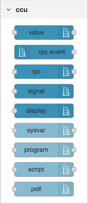
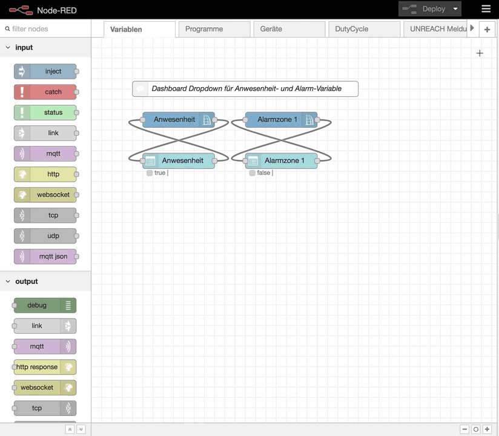
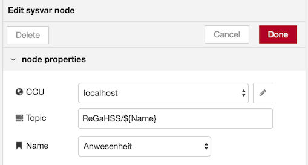

# CCU Nodes


<br><br><br>

* [connection](#ccu-connection-node)
* [value](#ccu-value-node)
* [rpc event](#ccu-rpc-event-node)
* [rpc](#ccu-rpc-node)
* [signal](#ccu-signal-node)
* [display](#ccu-display-node)
* [sysvar](#ccu-sysvar-node)
* [program](#ccu-program-node)
* [script](#ccu-script-node)
* [switch](#ccu-switch-node)
* [get value](#ccu-get-value-node)
* [poll](#ccu-poll-node)

<p>&nbsp;</p>

## ccu connection node
 
Im _Connection Node_ wird die Verbindung zu den CCU Schnittstellenprozessen und zur Logikschicht verwaltet. Der _Connection Node_ ist ein sogenannter _Configuration Node_, ist nicht in der _Palette_ sichtbar und kann nicht in einem _Flow_ platziert werden. Seine Konfiguration ist im Menü unter Configuration Nodes erreichbar: 

### Attribute

#### CCU Name

Frei wählbarer Name für die aktuelle CCU-Konfiguration.  
Er dient zur Unterscheidung falls mehrere CCUs an RedMatic angebunden werden und erscheint in allen anderen CCU Nodes.
#### CCU Address

Die IP-Adresse oder der Hostname der CCU.  
Wird RedMatic als CCU-Addon installiert, läuft es auf dem selben Device weshalb 
die Loopback-Adresse `localhost` bzw. `127.0.0.1` gewählt werden kann.

#### Listen Address

Die IP-Adresse des Netzwerk-Interfaces auf welchem die RedMatic RPC Server "lauschen" sollen.  
Läuft RedMatic auf der CCU wird hier ebenfalls `localhost` bzw. `127.0.0.1` verwendet.  
Um auf allen Interfaces zu lauschen kann `0.0.0.0` verwendet werden. 

#### Init Address

Die Init-Adresse wird den CCU-Schnittstellenprozessen für RPC-Callbacks mitgeilt. Läuft RedMatic auf der CCU ist 
ebenfalls `localhost` bzw. `127.0.0.1` zu verwenden. 


### BIN-RPC Port

Der Port des RedMatic BIN-RPC Dienstes an den die CCU Events schickt.
Werden Verbindungen zu mehreren CCUs hergestellt (mehrere ccu-configuration Node Instanzen)
braucht jede Verbindung einen exklusiven Port.

#### XML-RPC Port

Der Port des RedMatic XML-RPC Dienstes an den die CCU Events schickt.
Werden Verbindungen zu mehreren CCUs hergestellt braucht jede Verbindung einen exklusiven Port.

#### Interfaces

Hier können die zu verwendenden Schnittstellen angegeben werden.
Nutzt man Beispielsweise keinen CUxD oder HmIP Geräte, kann der Haken entfernt werden
was die entsprechenden ungenutzten Komponenten deaktiviert.

* ReGaHSS: Die Logikschicht der CCU, verwaltet CCU-Programme und CCU-Systemvariablen
* BidCos-RF: Homematic Funk
* BidCos-Wired: Homematic Wired
* HmIP-RF: Homematic-IP Funk
* VirtualDevices: Heizungsgruppen, in CCU eingebundene Systeme wie Osram Lightify
* CUxD

#### RPC Ping-Timeout

Zeitinterval in Sekunden in dem die Verbindung zu den Schnittstellenprozessen geprüft wird.   

#### ReGaHSS Polling

Änderungen von CCU-Systemvariablen werden nicht automatisch an RedMatic übermittelt.
Mit aktiviertem Polling fragt RedMatic die Variablen und deren Werte in den per 
Poll-Interval eingestellten Zeitintervallen ab. 

#### ReGaHSS Poll-Interval

Das Zeitintervall in Sekunden um die Systemvariablen von der CCU zu lesen.

#### Context-Store

Hier wird der Node-RED Context-Store festgelegt in dem RedMatic die Zustände aller Geräte/Variablen vorhält. 

Weiteres unter [Working with context](https://nodered.org/docs/user-guide/context) in der Node-RED Dokumentation.  

## ccu value node

Geräte steuern und/oder Events von einem Gerät empfangen.

### Attribute

#### CCU

Die zu verwendende CCU-Konfiguration.

#### Topic

Das Topic ist an [MQTT](https://de.wikipedia.org/wiki/MQTT) angelehnt und dient zu späteren
Identifizierung des Werts.

#### Interface

Hier wird das Interface gewählt, welches den gewünschten Datenpunkt enthält.

#### Channel

Der Kanal dessen Datenpunkte verwendet werden solln.
Er besteht aus der Serien- sowie der Kanalnummer.
Eine Autovervollständigung hilft bei der Auswahl anhand der Klarnamen.

#### Datapoint

Der Datenpunkt des Kanals, auch hier wird über eine Autovervollständigung die Auswahl vereinfacht.

#### ON_TIME

Zeit in Sekunden nach der ein Schaltaktor/Dimmer nach dem anschalten wieder ausgeschaltet werden soll.

Dabei ist:
* `undefined`: Keine automatische Ausschaltung
* `number`: Eine feste Verzögerung in Sekunden
* `global`, `flow`: Eine Verzögerung aus einer Context-Variablen
* `msg`: Eine Verzögerung aus einem `msg`-Property.

#### set Mode

Eine Erweiterung für Geräte, die sowohl den rx_mode BURST als auch
WAKEUP unterstützen wie z.B.: Batterie-Schaltaktoren oder Rauchmelder mit Sirenenfunktion.
Mit dem Parameter kann in diesem Fall angegeben werden,
ob der übergebene Wert über BURST oder WAKEUP übertragen werden soll.

* WAKEUP: Überträgt den Wert sobald der entsprechende Empfänger aufacht.
* BURST: Versucht alle BURST-Empfänger für die Übertragung aufzuwecken was sich
  negativ auf den DutyCycle und die Batterielaufzeit aller Burst-Empfänger auswirkt.

#### Flags

 * ***Nur geänderte Werte ausgeben***
   Ein Event wird nur dann erzeugt, wenn sich der Wert seit dem letztn Event verändert hat.

 * ***Während WORKING keine Werte ausgeben***
   Es gibt Aktoren, z.B. Dimmer oder Rolladen, die  während einer Rampe (Öffnen/Schließen eines Rollladen, Dimmen einer Lampe)
   fortwährend den aktuellen Zustand ausgeben. Um nur den End-Status auszugeben kann diese Option benutzt werden.
   Gebräuchlich auch bei Verwendung mit Dashboard-Nodes um "springende" Slider zu verhindern.

 * ***Beim Start letzten bekannten Wert ausgeben***
   Wenn Node-RED gestartet wird, dann wird der letzte Wert (sofern in der ReGaHSS bekannt) ausgegeben.
   Z.B. um beim Start einen korrekten Wert an das Dashboard zu übergeben.
   **Achtung**: Wird durch die ausgegebene Nachricht im weiteren Verlauf des Flows ein Homematic Wert gesetzt wirkt sich
   jedes (Full-)Deployment negativ auf den DutyCycle aus.


#### Name

Der Name dient zur Beschriftung des Node im Flow.

### Input

Für den Input des Value Node wird `msg.payload` als der Wert verwendet der in den Datenpunkt geschrieben wird.

Die Bestimmung des Datenpunkts sowie des Kanals und der Schnittstellen können hier dynamisch
sein. Dazu werden die entsprechenden Node-Attribute leer gelassen und über `msg` gesetzt.

**Option 1:**
Interface, Channel und Datapoint können in der `msg` als Properties angegeben werden:

```json
{
  "interface": "BidCos-RF",
  "channel": "OEQ1868878:1",
  "datapoint": "STATE",
  "payload": true
}
```

**Option 2:**
Der Datenpunkt kann über `msg.topic` angegeben werden wobei die Werte mit Punkt getrennt werden:
```json
{
  "topic": "BidCos-RF.OEQ1868878:1.STATE",
  "payload": true
}
```

### Output

Der Value Node gibt nur Events aus, wenn Interface, Channel und Datapoint gesetzt sind.

## ccu rpc event node

Events von einem oder mehreren Geräten empfangen. Filter...

## ccu rpc node

Beliebige RPC Methoden auf Schnittstellenprozess aufrufen und deren Rückgabe ausgeben.

## ccu signal node

Ansteuerung von Funk-Gongs (HM-OU-CFM-*, HM-OU-CM-PCB).

## ccu display node

Ansteuerung von Displays (HM-PB-4Dis-WM, HM-Dis-EP-WM55).


## ccu sysvar node

Rega-Systemvariablen setzen und Wertänderungen empfangen.




## ccu program node

Rega-Programme starten, aktivieren oder deaktivieren. Gibt den Zeitpunkt der letzten Programmausführung aus.

## ccu script node

Beliebige Rega-Scripte starten und deren Rückgabe ausgeben.

## ccu poll node

Sofortige Abfrage von Rega-Systemvariablen und -Programmen auslösen.


# Attribute

## topic

Einige der CCU Nodes erlauben es in ihrer Topic-Konfiguration Platzhalter wie z.B. `${channelName}` zu verwenden. Dadurch ist es möglich das Topic dynamisch aus einem eingehenden Event zu erzeugen. Im den Nodes _RPC_ und _Value_ stehen dafür alle Attribute zur Verfügung die auch zum Filtern von Events konfiguriert werden können.
