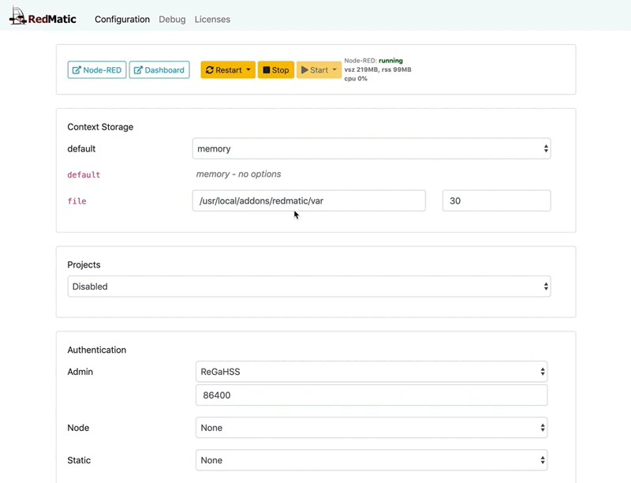

Um den Node-RED Context auch über Neustarts hinweg persistent zu halten gibt es die Möglichkeit den Default Context Storage auf `file` umzustellen. Um die SD-Karte vor zu vielen Schreibzugriffen zu bewahren ist hierfür unbedingt ein USB-Stick zu verwenden!
Der Wert 30 ist der Intervall in Sekunden wie oft der Context auf den Datenträger geschrieben wird.
