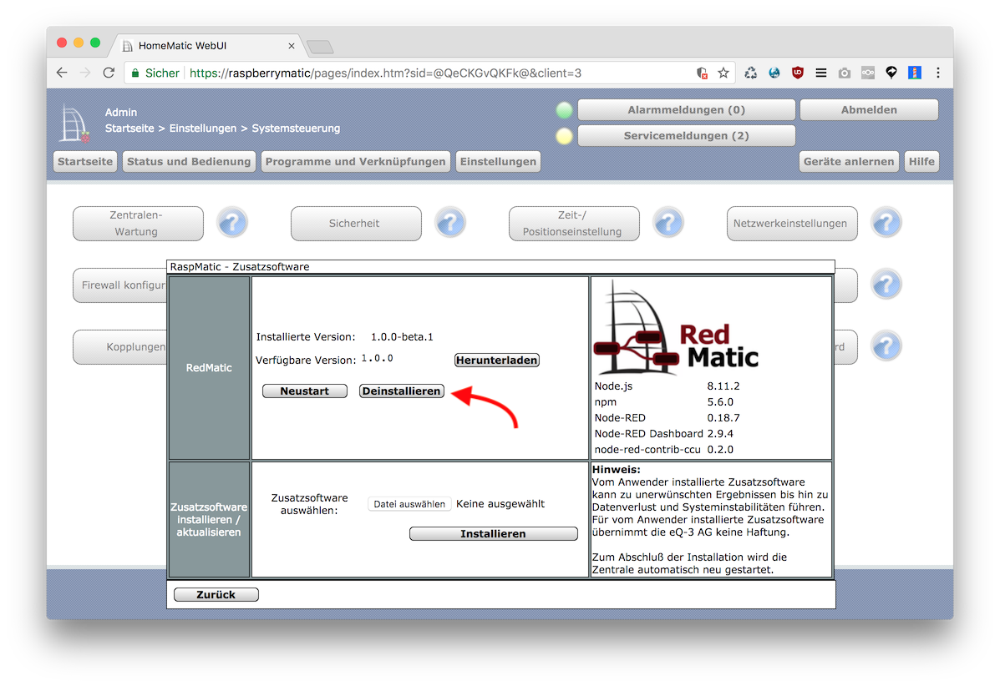

Im Homematic WebUI unter _Systemsteuerung_ - _Zusatzsoftware_ auf _Deinstallieren_ klicken:

Das Addon sollte nach einigen Sekunden - selbst ohne Reboot - vollständig entfernt worden sein. 

__Achtung__: Hierbei werden auch die Node-RED Flows gelöscht. Wenn man diese vor der Deinstallation sichern möchte findet sich die Flows Datei hier: `/usr/local/addons/node-red/var/flows.json`

Es ist auch möglich das Addon über die Kommandozeile zu entfernen: `/usr/local/etc/config/rc.d/node-red uninstall`

Folgende Dateien und Ordner werden vom Addon auf der CCU Installiert, sollte eine Deinstallation nicht fehlerfrei ablaufen, können diese auch manuell gelöscht werden:

* /usr/local/addons/node-red
* /usr/local/etc/config/addons/www/redmatic
* /usr/local/etc/config/lighttpd/node-red.conf
* /usr/local/etc/config/rc.d/node-red
* `node-red` und `node-red-dashboard` in /usr/local/etc/config/hm_addons.cfg