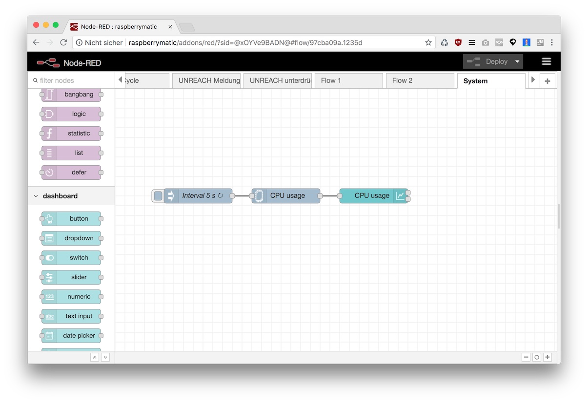

Dieser Flow benötigt [node-red-contrib-cpu](https://flows.nodered.org/node/node-red-contrib-cpu) (siehe [Zusätzliche Nodes installieren](Node-Installation))




#### Flow JSON

```
[{"id":"97cba09a.1235d","type":"tab","label":"System","disabled":false,"info":""},{"id":"5cb51c90.def0b4","type":"cpu","z":"97cba09a.1235d","name":"","msgCore":true,"msgOverall":false,"x":350,"y":220,"wires":[["ab99ceba.4b6f7"]]},{"id":"ff268081.9234e","type":"inject","z":"97cba09a.1235d","name":"Interval 5 s","topic":"","payload":"","payloadType":"date","repeat":"5","crontab":"","once":false,"onceDelay":0.1,"x":170,"y":220,"wires":[["5cb51c90.def0b4"]]},{"id":"ab99ceba.4b6f7","type":"ui_chart","z":"97cba09a.1235d","name":"","group":"b97f6821.22ca98","order":0,"width":0,"height":0,"label":"CPU usage","chartType":"line","legend":"false","xformat":"HH:mm:ss","interpolate":"linear","nodata":"","dot":false,"ymin":"","ymax":"","removeOlder":1,"removeOlderPoints":"","removeOlderUnit":"3600","cutout":0,"useOneColor":false,"colors":["#1f77b4","#aec7e8","#ff7f0e","#2ca02c","#98df8a","#d62728","#ff9896","#9467bd","#c5b0d5"],"useOldStyle":false,"x":530,"y":220,"wires":[[],[]]},{"id":"b97f6821.22ca98","type":"ui_group","z":"","name":"System","tab":"7e356c80.0970c4","disp":false,"width":"6","collapse":false},{"id":"7e356c80.0970c4","type":"ui_tab","z":"","name":"System","icon":"dashboard"}]
```