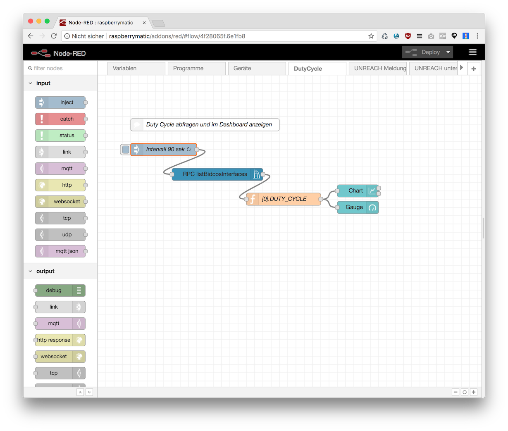
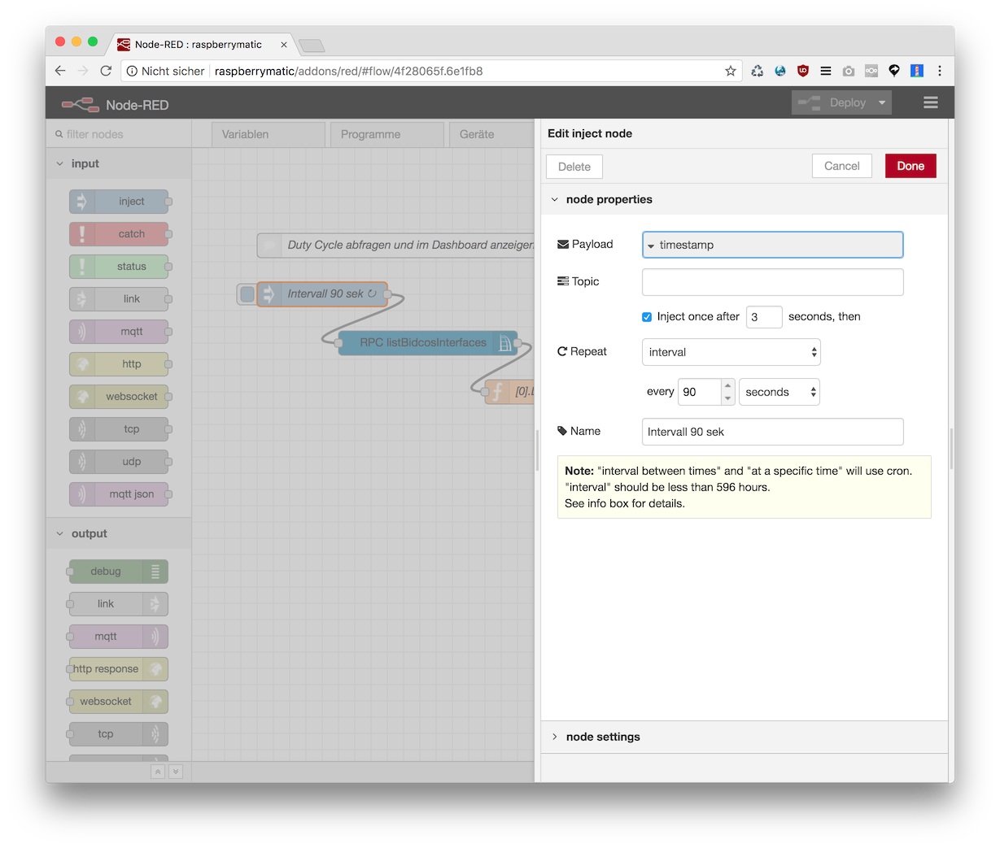
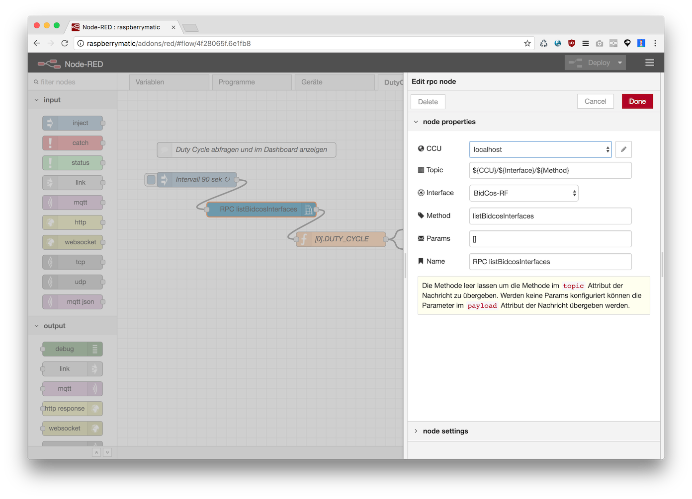
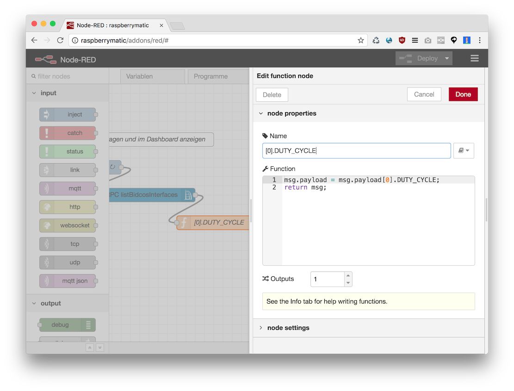
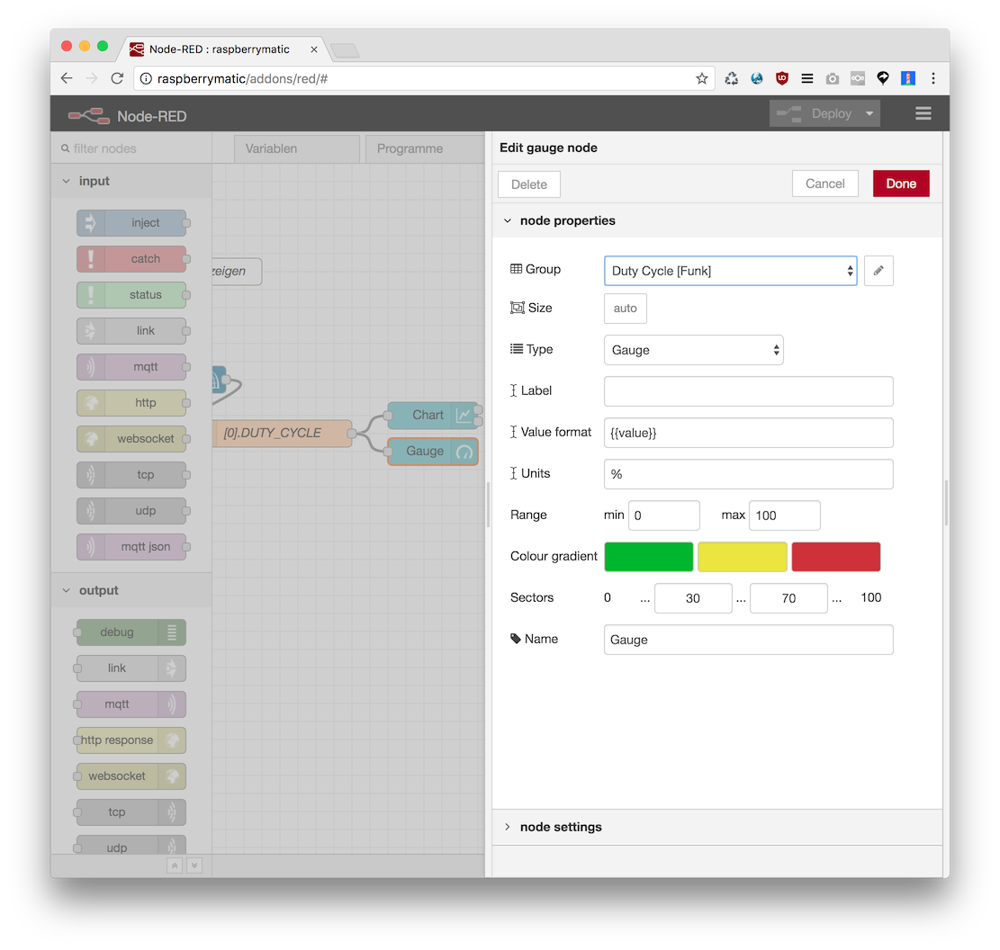
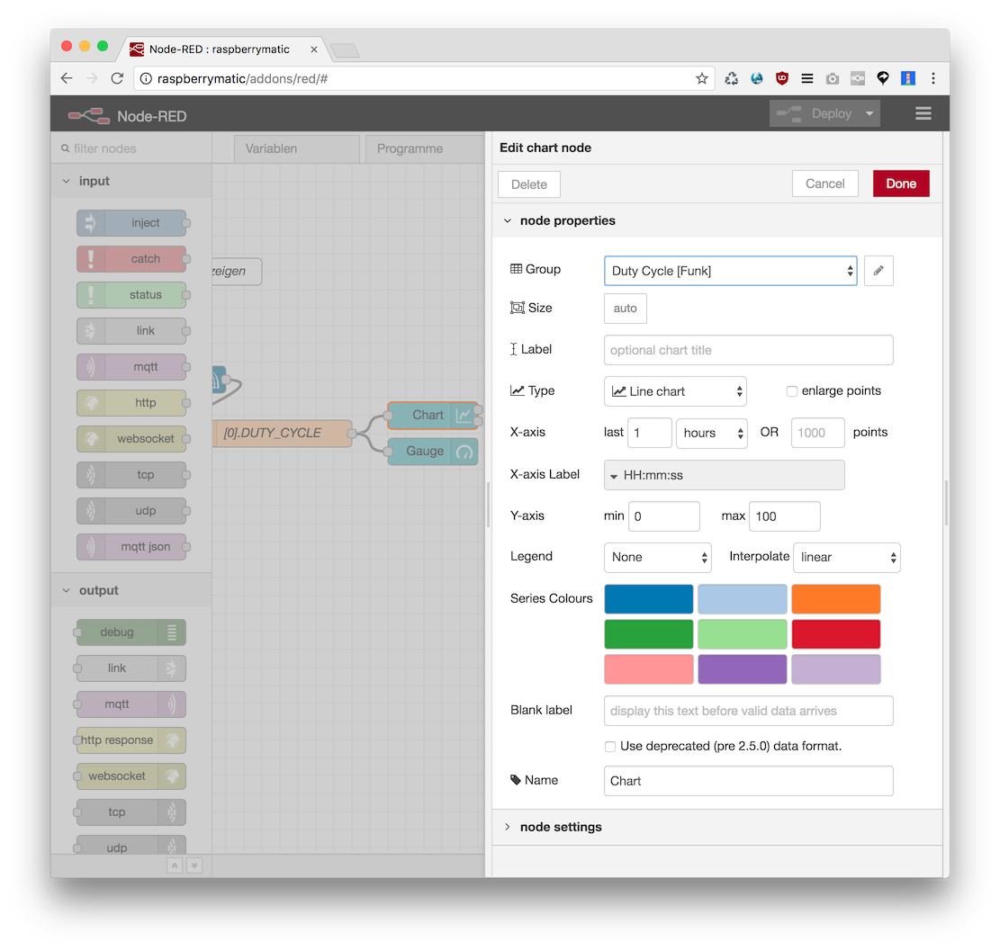
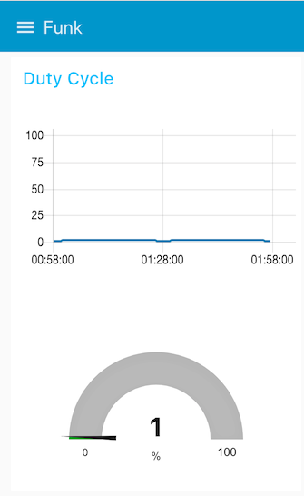

Dieser Flow erzeugt eine Chart/Gauge Darstellung des DutyCycles des ersten Interfaces im Dashboard











Im Dashboard sollte das so aussehen:




## Flow JSON

```
[{"id":"4f28065f.6e1fb8","type":"tab","label":"DutyCycle","disabled":false,"info":""},{"id":"cb73e4c8.3727f8","type":"ccu-rpc","z":"4f28065f.6e1fb8","name":"RPC listBidcosInterfaces","ccuConfig":"38263145.35ea0e","iface":"BidCos-RF","method":"listBidcosInterfaces","params":"[]","topic":"${CCU}/${Interface}/${Method}","x":290,"y":240,"wires":[["f1401630.4984a8"]]},{"id":"e638976b.ab6b08","type":"inject","z":"4f28065f.6e1fb8","name":"Intervall 90 sek","topic":"","payload":"","payloadType":"date","repeat":"90","crontab":"","once":true,"onceDelay":"3","x":160,"y":180,"wires":[["cb73e4c8.3727f8"]]},{"id":"f1401630.4984a8","type":"function","z":"4f28065f.6e1fb8","name":"[0].DUTY_CYCLE","func":"msg.payload = msg.payload[0].DUTY_CYCLE;\nreturn msg;","outputs":1,"noerr":0,"x":450,"y":300,"wires":[["b1f9846d.fff208","8ade4d23.4950b"]]},{"id":"b1f9846d.fff208","type":"ui_chart","z":"4f28065f.6e1fb8","name":"Chart","group":"937d90ca.8d8b","order":0,"width":0,"height":0,"label":"","chartType":"line","legend":"false","xformat":"HH:mm:ss","interpolate":"linear","nodata":"","dot":false,"ymin":"0","ymax":"100","removeOlder":1,"removeOlderPoints":"","removeOlderUnit":"3600","cutout":0,"useOneColor":false,"colors":["#1f77b4","#aec7e8","#ff7f0e","#2ca02c","#98df8a","#d62728","#ff9896","#9467bd","#c5b0d5"],"useOldStyle":false,"x":630,"y":280,"wires":[[],[]]},{"id":"8ade4d23.4950b","type":"ui_gauge","z":"4f28065f.6e1fb8","name":"Gauge","group":"937d90ca.8d8b","order":0,"width":0,"height":0,"gtype":"gage","title":"","label":"%","format":"{{value}}","min":0,"max":"100","colors":["#00b500","#e6e600","#ca3838"],"seg1":"30","seg2":"70","x":630,"y":320,"wires":[]},{"id":"b289d39d.59bd4","type":"comment","z":"4f28065f.6e1fb8","name":"Duty Cycle abfragen und im Dashboard anzeigen","info":"Dieser Flow fragt in Intervallen \nvon 30 sekunden den Duty Cycle des \nersten Funk-Interfaces des BidCos-RF\nSchnittstellenprozess (\"rfd\") per RPC ab \nund visualisiert ihn in Node-RED Dashboard.","x":260,"y":120,"wires":[]},{"id":"38263145.35ea0e","type":"ccu-connection","z":"","name":"localhost","host":"localhost","regaEnabled":true,"bcrfEnabled":true,"iprfEnabled":true,"virtEnabled":true,"bcwiEnabled":false,"cuxdEnabled":false,"regaPoll":true,"regaInterval":"30","rpcPingTimeout":"60","rpcInitAddress":"127.0.0.1","rpcServerHost":"127.0.0.1","rpcBinPort":"2047","rpcXmlPort":"2048"},{"id":"937d90ca.8d8b","type":"ui_group","z":"","name":"Duty Cycle","tab":"8153eb0.fe96118","disp":true,"width":"6","collapse":false},{"id":"8153eb0.fe96118","type":"ui_tab","z":"","name":"Funk","icon":"dashboard","order":4}]
```
