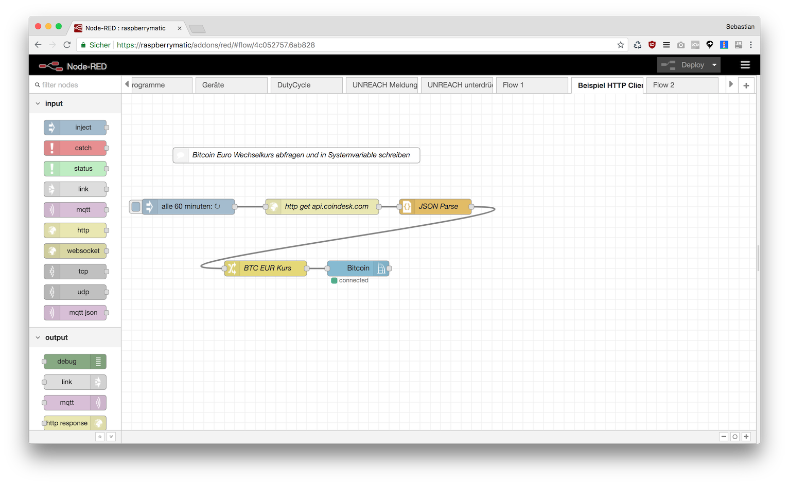
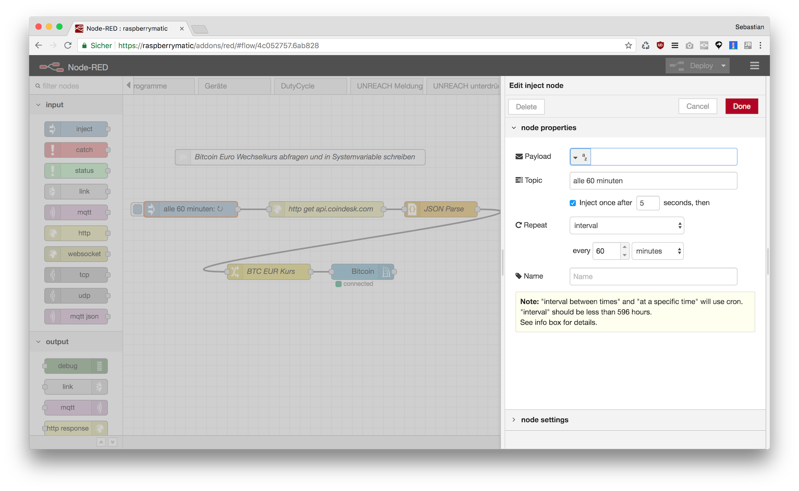
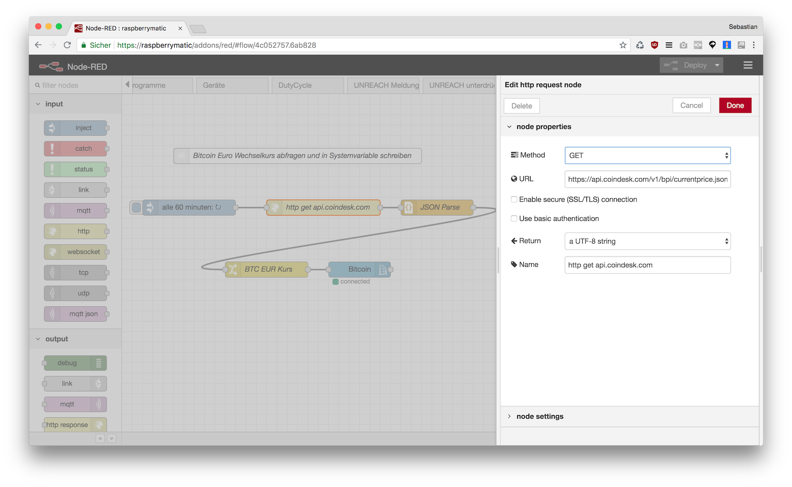
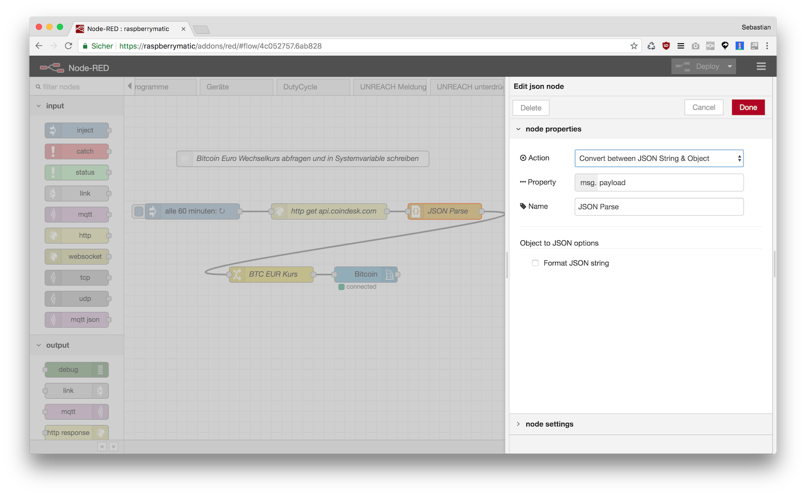
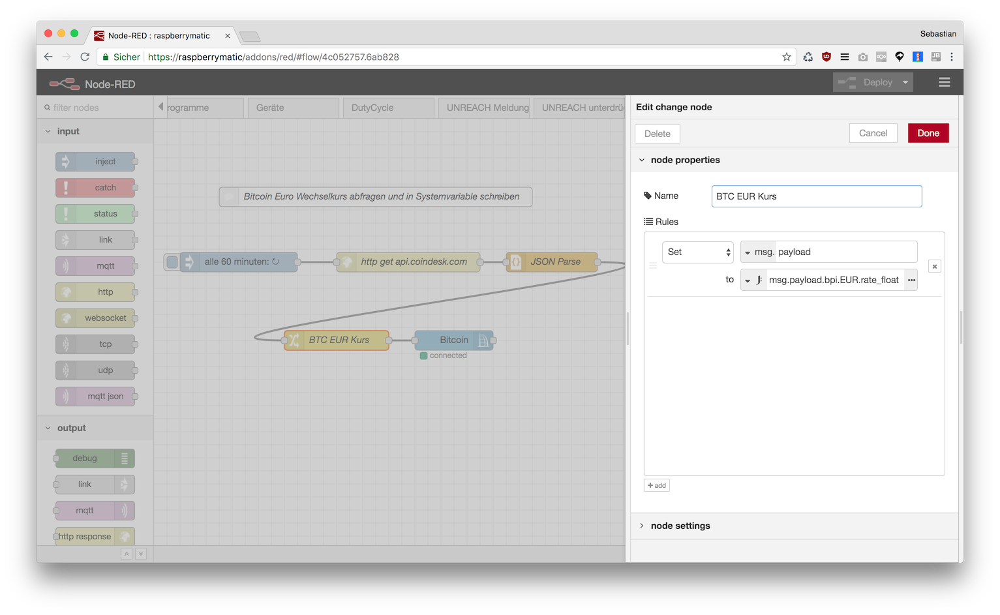
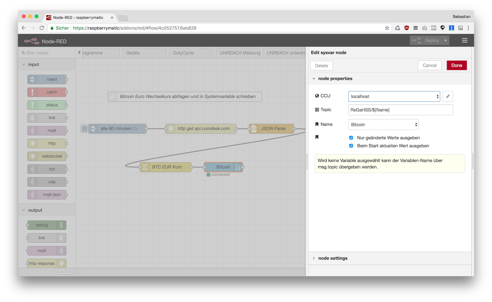
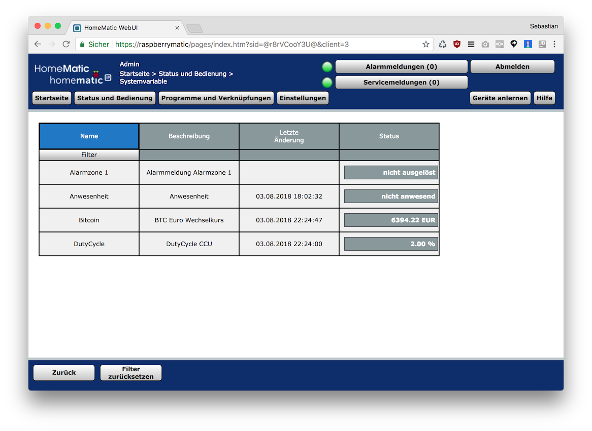

# JSON Daten von Webservice abfragen und in Systemvariable schreiben

Für dieses Beispiel wird ein Webservice verwendet der den aktuellen Wechselkurs des Bitcoin zurückgibt. Er eignet sich gut als Beispiel da er keinen API Key verlangt und das zurückgegebene JSON recht übersichtlich ist:

`https://api.coindesk.com/v1/bpi/currentprice.json`

```Javascript
{
	"time": {
		"updated": "Aug 3, 2018 20:09:00 UTC",
		"updatedISO": "2018-08-03T20:09:00+00:00",
		"updateduk": "Aug 3, 2018 at 21:09 BST"
	},
	"disclaimer": "This data was produced from the CoinDesk Bitcoin Price Index (USD). Non-USD currency data converted using hourly conversion rate from openexchangerates.org",
	"chartName": "Bitcoin",
	"bpi": {
		"USD": {
			"code": "USD",
			"symbol": "&#36;",
			"rate": "7,388.6163",
			"description": "United States Dollar",
			"rate_float": 7388.6163
		},
		"GBP": {
			"code": "GBP",
			"symbol": "&pound;",
			"rate": "5,683.2867",
			"description": "British Pound Sterling",
			"rate_float": 5683.2867
		},
		"EUR": {
			"code": "EUR",
			"symbol": "&euro;",
			"rate": "6,384.5550",
			"description": "Euro",
			"rate_float": 6384.555
		}
	}
}
```





## Inject Node

Ein Inject Node wird genutzt um alle 60 Minuten eine Message zu erzeugen die den Flow startet:



## HTTP Request Node

Der HTTP Request Node holt die Daten vom Webservice ab:



## JSON Node

Der JSON Node parsed die vom HTTP Request Node erhaltene Daten:



## Change Node

Der Change Node extrahiert die gewünschte Property (`rate_float`) in der der Euro Kurs als Number enthalten ist:



## CCU Sysvar Node

Am Ende wird der Wert in eine Systemvariable geschrieben.





# Flow JSON

```
[{"id":"65b68306.0b66ec","type":"http request","z":"4c052757.6ab828","name":"http get api.coindesk.com","method":"GET","ret":"txt","url":"https://api.coindesk.com/v1/bpi/currentprice.json","tls":"","x":390,"y":220,"wires":[["cd1a4c0c.0147c"]]},{"id":"c30aecd5.90709","type":"inject","z":"4c052757.6ab828","name":"","topic":"alle 60 minuten","payload":"","payloadType":"str","repeat":"3600","crontab":"","once":true,"onceDelay":"5","x":130,"y":220,"wires":[["65b68306.0b66ec"]]},{"id":"cd1a4c0c.0147c","type":"json","z":"4c052757.6ab828","name":"JSON Parse","property":"payload","action":"","pretty":false,"x":610,"y":220,"wires":[["744d138a.1f395c"]]},{"id":"744d138a.1f395c","type":"change","z":"4c052757.6ab828","name":"BTC EUR Kurs","rules":[{"t":"set","p":"payload","pt":"msg","to":"msg.payload.bpi.EUR.rate_float","tot":"jsonata"}],"action":"","property":"","from":"","to":"","reg":false,"x":280,"y":340,"wires":[["911ee1f9.ccf3a"]]},{"id":"911ee1f9.ccf3a","type":"ccu-sysvar","z":"4c052757.6ab828","name":"Bitcoin","ccuConfig":"38263145.35ea0e","topic":"ReGaHSS/${Name}","change":true,"cache":true,"x":460,"y":340,"wires":[[]]},{"id":"c73c65fe.9c17c8","type":"comment","z":"4c052757.6ab828","name":"Bitcoin Euro Wechselkurs abfragen und in Systemvariable schreiben","info":"","x":340,"y":120,"wires":[]},{"id":"38263145.35ea0e","type":"ccu-connection","z":"","name":"localhost","host":"localhost","regaEnabled":true,"bcrfEnabled":true,"iprfEnabled":true,"virtEnabled":true,"bcwiEnabled":false,"cuxdEnabled":false,"regaPoll":true,"regaInterval":"30","rpcPingTimeout":"60","rpcInitAddress":"127.0.0.1","rpcServerHost":"127.0.0.1","rpcBinPort":"2047","rpcXmlPort":"2048"}]
```