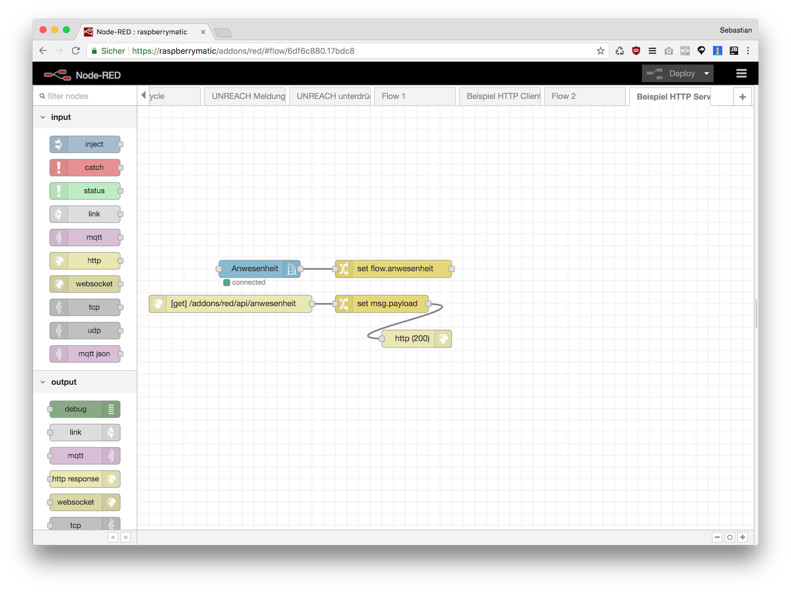
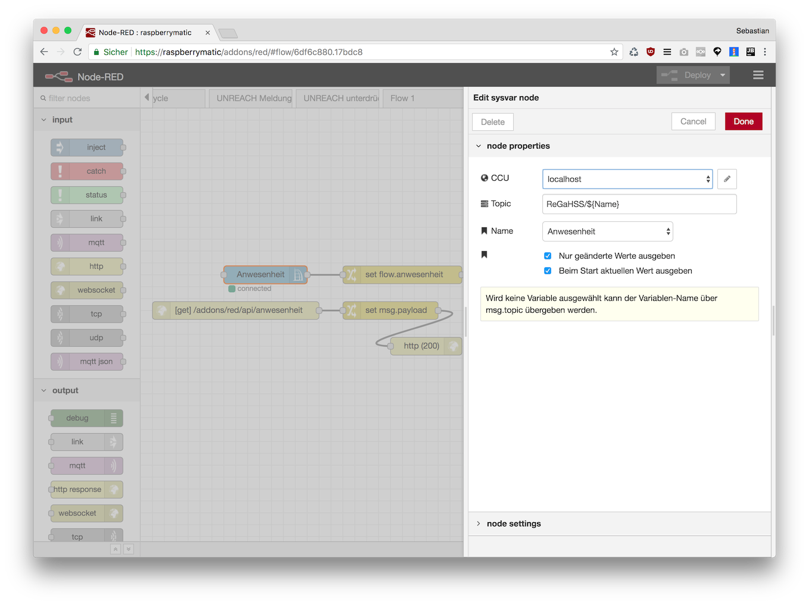
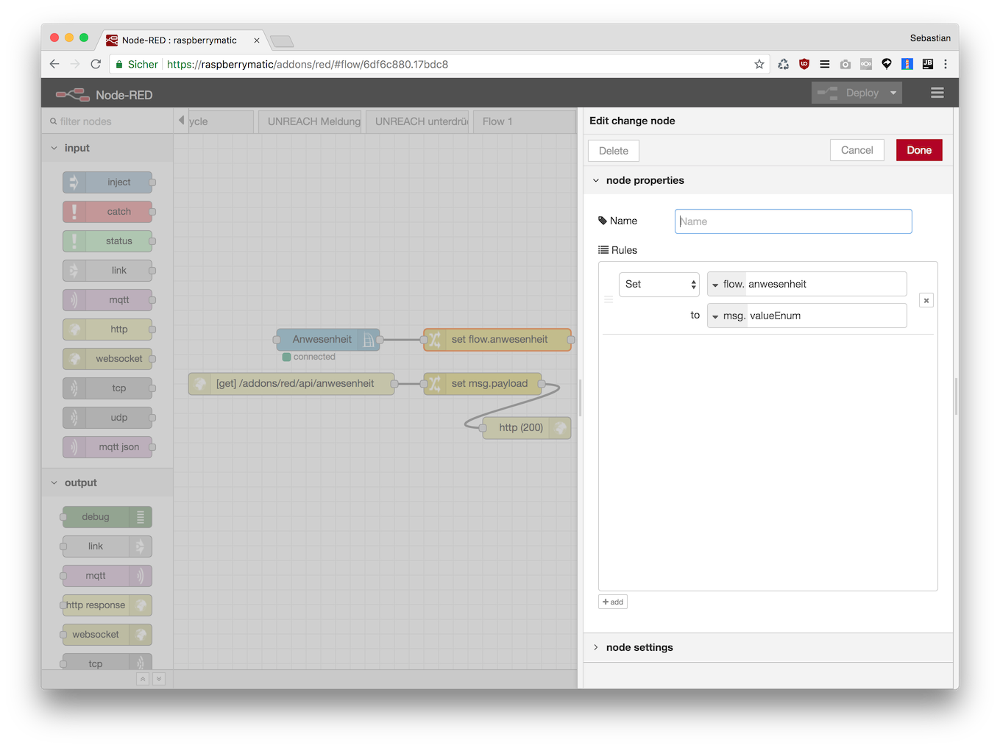
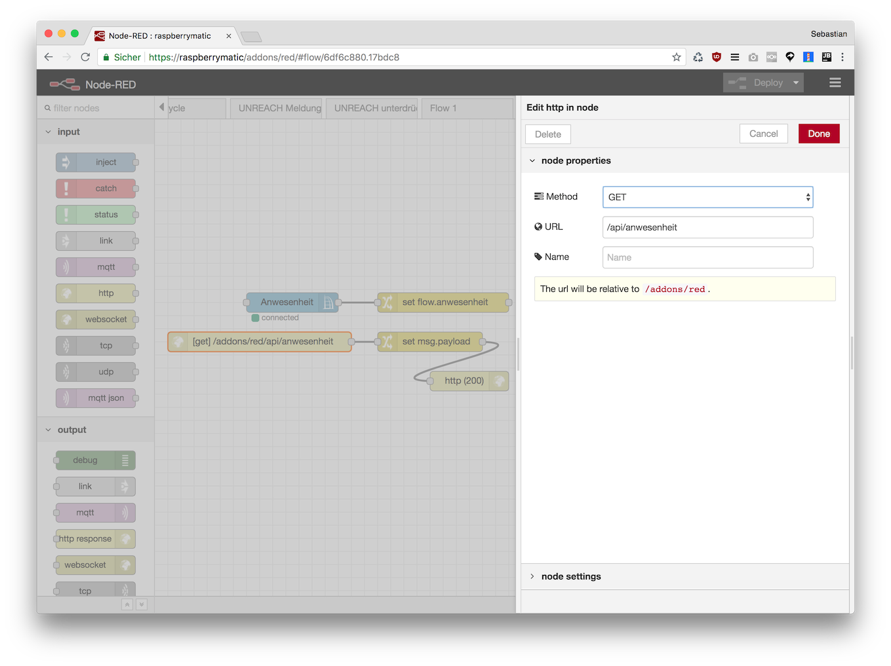
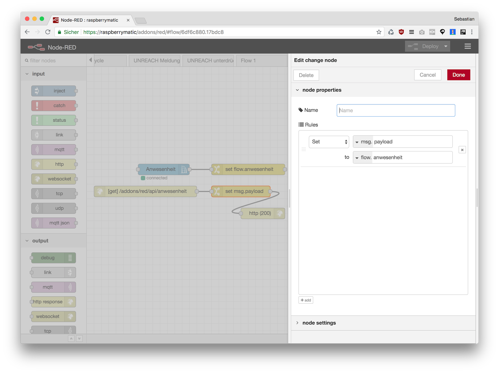
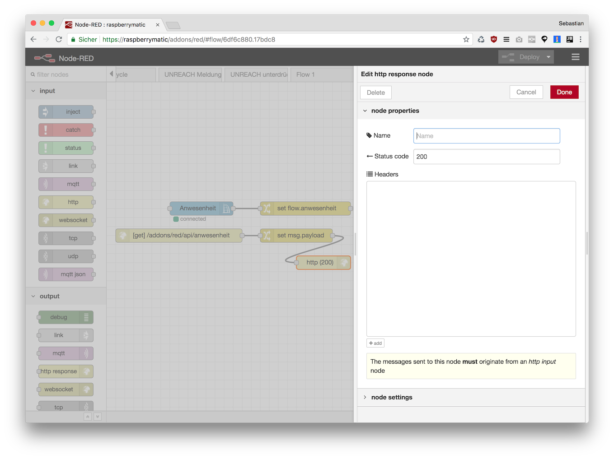
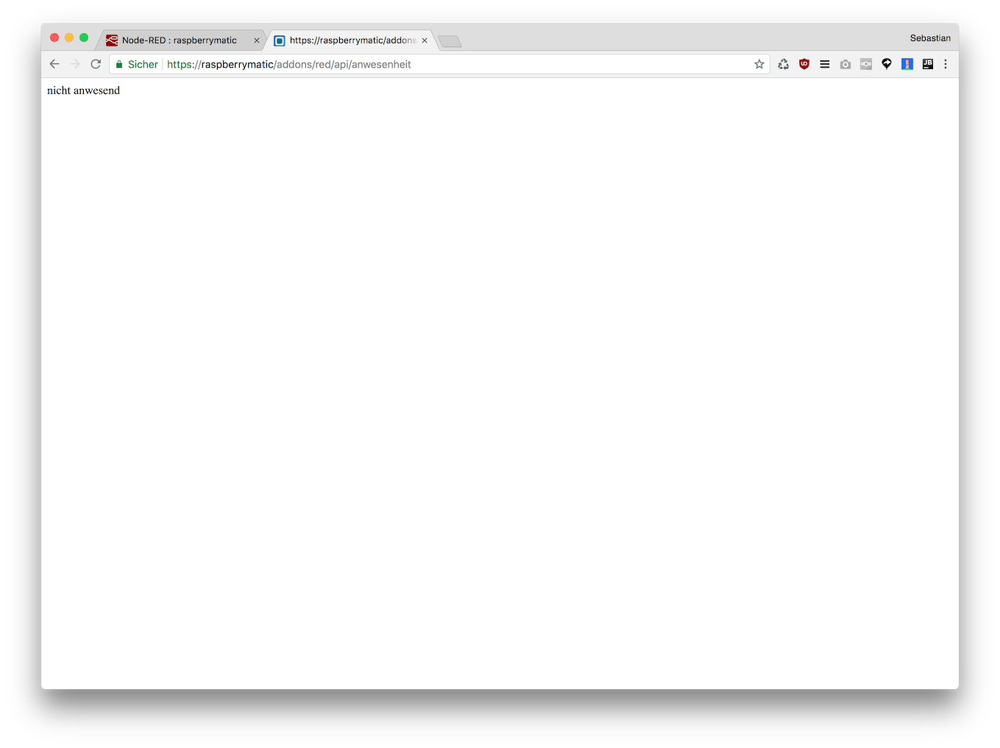

# Inhalt einer Systemvariablen über einfachen Webservice bereitstellen

Dieses Beispiel ermöglicht es den Zustand der Systemvariable "Anwesenheit" via HTTP GET abzufragen.



### CCU Sysvar Node



### Function Change Node

Der Change Node schreibt die Textdarstellung der Variable (wird vom Sysvar Node in der Property `valueEnum` bereitgestellt) in den _Flow Context_. 



### Input HTTP Node 



### Function Change Node

Dieser Change Node überträgt die zuvor im _Flow Context_ gespeicherte Variable in den `msg.payload`.



### Output HTTP Response Node

Dieser Node beantwortet die HTTP Anfrage



## Nun kann `http://<ccu-adresse>/addons/red/api/anwesenheit` genutzt werden:




## Flow JSON

```
[{"id":"b5b2e0ba.c82a1","type":"http in","z":"6df6c880.17bdc8","name":"","url":"/api/anwesenheit","method":"get","upload":false,"swaggerDoc":"","x":160,"y":340,"wires":[["71e11ca6.dd7d44"]]},{"id":"3c7be0fe.9c89a","type":"http response","z":"6df6c880.17bdc8","name":"","statusCode":"200","headers":{},"x":480,"y":400,"wires":[]},{"id":"71e11ca6.dd7d44","type":"change","z":"6df6c880.17bdc8","name":"","rules":[{"t":"set","p":"payload","pt":"msg","to":"anwesenheit","tot":"flow"}],"action":"","property":"","from":"","to":"","reg":false,"x":420,"y":340,"wires":[["3c7be0fe.9c89a"]]},{"id":"c2ee148f.469068","type":"ccu-sysvar","z":"6df6c880.17bdc8","name":"Anwesenheit","ccuConfig":"38263145.35ea0e","topic":"ReGaHSS/${Name}","change":true,"cache":true,"x":210,"y":280,"wires":[["3d63cbe.aa0ca34"]]},{"id":"3d63cbe.aa0ca34","type":"change","z":"6df6c880.17bdc8","name":"","rules":[{"t":"set","p":"anwesenheit","pt":"flow","to":"valueEnum","tot":"msg"}],"action":"","property":"","from":"","to":"","reg":false,"x":440,"y":280,"wires":[[]]},{"id":"38263145.35ea0e","type":"ccu-connection","z":"","name":"localhost","host":"localhost","regaEnabled":true,"bcrfEnabled":true,"iprfEnabled":true,"virtEnabled":true,"bcwiEnabled":false,"cuxdEnabled":false,"regaPoll":true,"regaInterval":"30","rpcPingTimeout":"60","rpcInitAddress":"127.0.0.1","rpcServerHost":"127.0.0.1","rpcBinPort":"2047","rpcXmlPort":"2048"}]
```