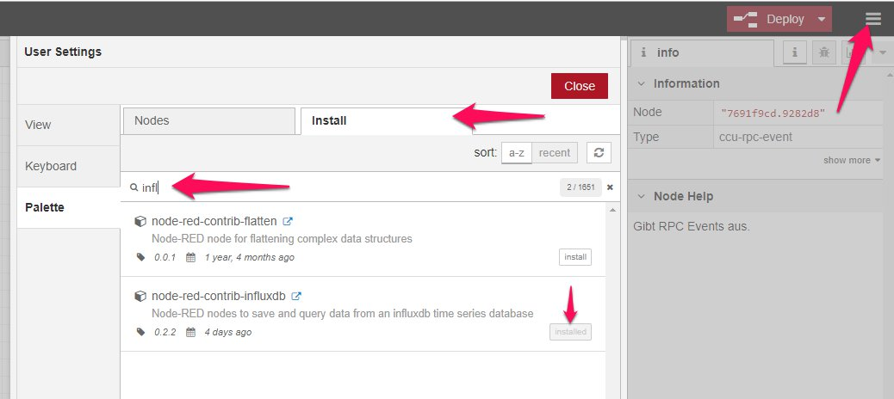
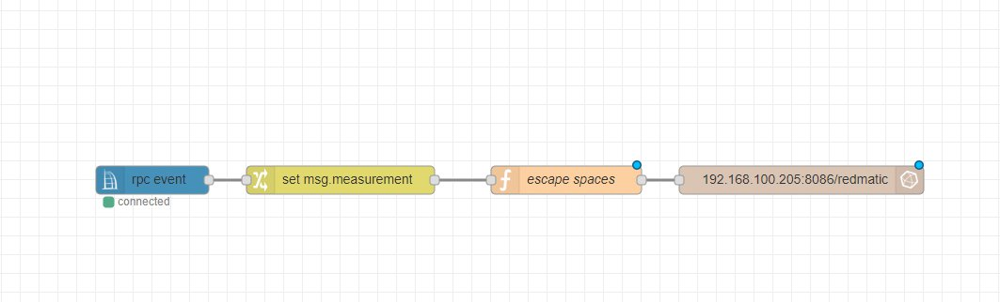
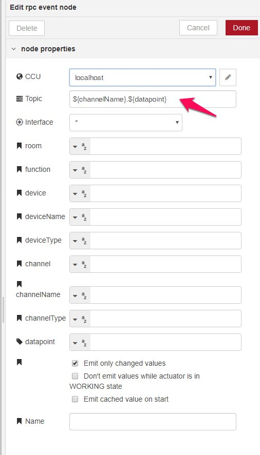
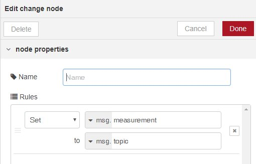
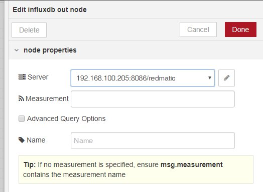

Als erstes alle benötigen Komponenten installieren (redmatic, TICK-Stack, grafana). Dann die Verbindung in redmatic zur ccu einrichten, Datenbank in influxdb einrichten, datasource in grafana einrichten.

Dann in redmatic influxdb adapter installieren: Burger-Menu, manage palette, dann


Dann den Flow anlegen


im rpc event Topic wie gewünscht anlegen, wenn gewünscht Filter einrichten, "emit only changed values" auswählen


Mit change node die in msg.topic enthaltenen Daten in msg.measurement umspeichern, da influxdb die Daten dort erwartet


Dann mit function-Node und folgendem Skript Leerzeichen escapen (Bug im influxdb-Connector, wenn der mal gefixt wird, erhält man evtl. doppelte \\, dann das Skript wieder löschen):

```javascript
msg.measurement = msg.measurement.replace(/ /g, '\\ ');
return msg;
```

Und dann ab in die Datenbank:
