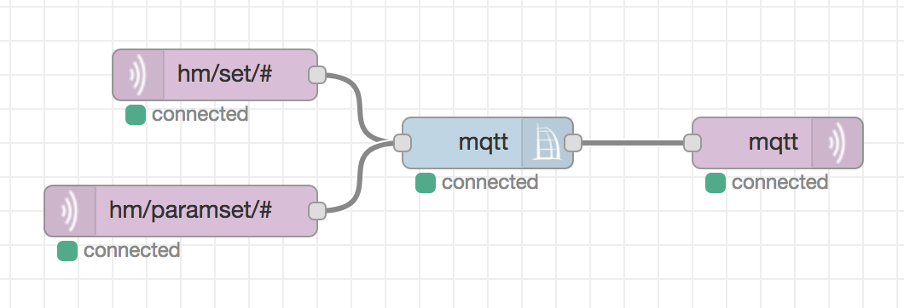

Als Nachfolger/Ersatz für die nicht mehr weiterentwickelten Tools [hm2mqtt](https://github.com/owagner/hm2mqtt) bzw. [hm2mqtt.js](https://guthub.com/hobbyquaker/hm2mqtt.js) ist es möglich die Anbindung einer CCU an MQTT mit RedMatic zu bewerkstelligen. Für diesen Zweck steht der spezieller Node "CCU MQTT" bereit der (in default Konfiguration) die gleichen Topics/Payloads verarbeitet wie hm2mqtt. Er muss lediglich an seinem Eingang mit MQTT Subscribe Nodes und an seinem Ausgang mit einem MQTT Publish Node verbunden werden:

Möchte man einen MQTT Broker auf der CCU installieren steht "Mosquitto" als Addon Paket hier zur Verfügung: https://github.com/hobbyquaker/ccu-addon-mosquitto

Eine Umfangreiche Liste von Software die im Zusammenhang mit MQTT von Nutzen sein kann steht hier zur Verfügung: https://github.com/hobbyquaker/awesome-mqtt

