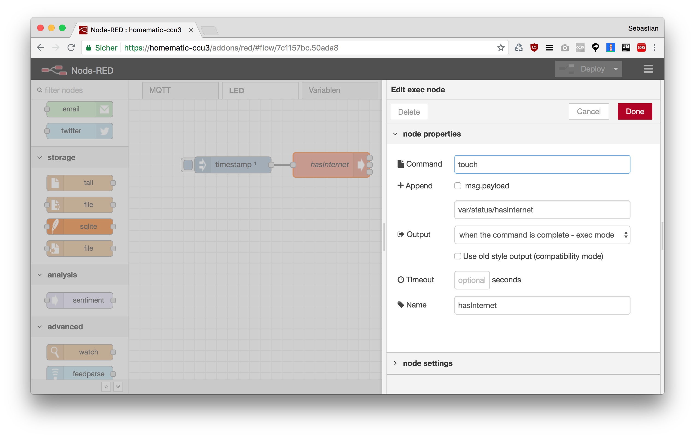

Wird die CCU ohne Internetverbindung betrieben blinkt die LED dauerhaft schnell blau. Möchte man dies verhindern ist das mit folgendem Flow möglich:



Nach dem Start von Node-RED wird die Datei `/var/status/hasInternet` angelegt, dies "gaukelt" der CCU vor es würde eine Internetverbindung bestehen.

### Flow JSON

```
[{"id":"7c1157bc.50ada8","type":"tab","label":"LED","disabled":false,"info":""},{"id":"8b0daa6c.ad3158","type":"inject","z":"7c1157bc.50ada8","name":"","topic":"","payload":"","payloadType":"date","repeat":"","crontab":"","once":true,"onceDelay":0.1,"x":190,"y":120,"wires":[["a54ca9a4.ef5b38"]]},{"id":"a54ca9a4.ef5b38","type":"exec","z":"7c1157bc.50ada8","command":"touch","addpay":false,"append":"/var/status/hasInternet","useSpawn":"false","timer":"","oldrc":false,"name":"hasInternet","x":370,"y":120,"wires":[[],[],[]]}]
```