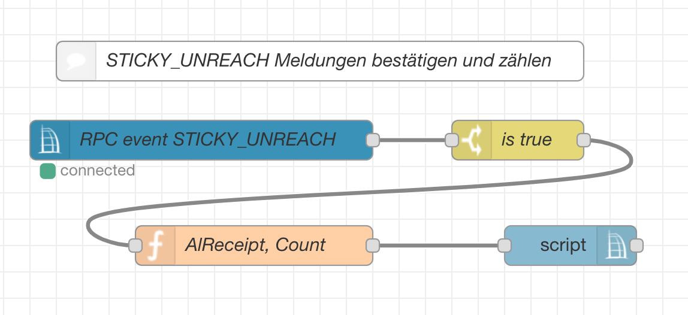

Dieser Flow setzt alle `STICKY_UNREACH` Servicemeldungen umgehend zurück:



### Flow JSON

```
[{"id":"2e25bc4b.5ec234","type":"ccu-rpc-event","z":"d93ee77.7acbf18","name":"RPC event STICKY_UNREACH","iface":"","ccuConfig":"38263145.35ea0e","rooms":"","roomsRx":"str","functions":"","functionsRx":"str","device":"","deviceRx":"str","deviceName":"","deviceNameRx":"str","deviceType":"","deviceTypeRx":"str","channel":"","channelRx":"str","channelName":"","channelNameRx":"str","channelType":"","channelTypeRx":"str","datapoint":"STICKY_UNREACH","datapointRx":"str","change":true,"working":false,"cache":true,"topic":"${channel}","x":170,"y":480,"wires":[["686f2f59.79d12"]]},{"id":"686f2f59.79d12","type":"switch","z":"d93ee77.7acbf18","name":"is true?","property":"payload","propertyType":"msg","rules":[{"t":"true"}],"checkall":"true","repair":false,"outputs":1,"x":420,"y":480,"wires":[["f0641839.94d878"]]},{"id":"f0641839.94d878","type":"change","z":"d93ee77.7acbf18","name":"set to false","rules":[{"t":"set","p":"payload","pt":"msg","to":"false","tot":"bool"}],"action":"","property":"","from":"","to":"","reg":false,"x":610,"y":480,"wires":[["5c89e574.f23a5c"]]},{"id":"5c89e574.f23a5c","type":"ccu-value","z":"d93ee77.7acbf18","name":"","iface":"","channel":"","datapoint":"","mode":"","start":true,"change":true,"cache":false,"on":0,"onType":"undefined","ramp":0,"rampType":"undefined","working":false,"ccuConfig":"38263145.35ea0e","topic":"${CCU}/${Interface}/${channel}/${datapoint}","x":790,"y":480,"wires":[[]]},{"id":"6e134331.53704c","type":"comment","z":"d93ee77.7acbf18","name":"STICKY_UNREACH zurücksetzen","info":"","x":190,"y":400,"wires":[]},{"id":"38263145.35ea0e","type":"ccu-connection","z":"","name":"localhost","host":"localhost","regaEnabled":true,"bcrfEnabled":true,"iprfEnabled":true,"virtEnabled":true,"bcwiEnabled":true,"cuxdEnabled":false,"regaPoll":true,"regaInterval":"30","rpcPingTimeout":"60","rpcInitAddress":"127.0.0.1","rpcServerHost":"127.0.0.1","rpcBinPort":"2047","rpcXmlPort":"2048","contextStore":""}]
```
