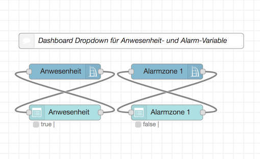
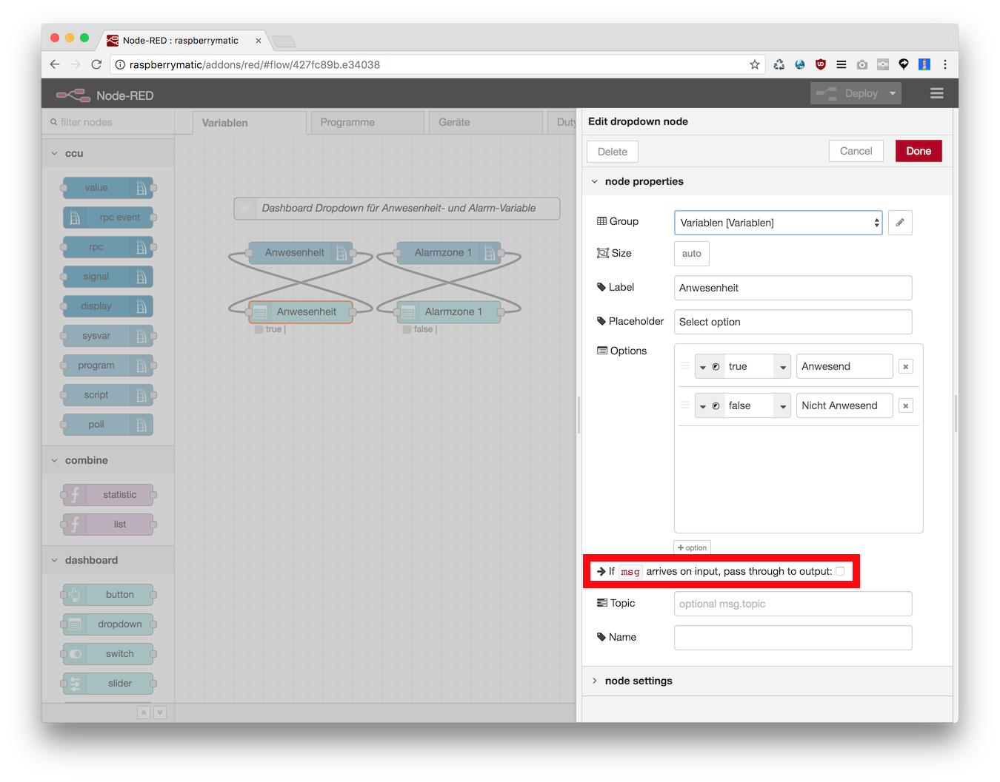
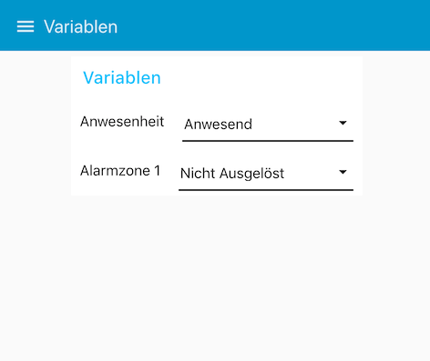

Dieser Beispielflow erstellt ein einfaches Dashboard mit dem der Zustand der Variablen "Anwesenheit" und "Alarmzone 1"
angezeigt und geändert werden kann. 

* Es müssen lediglich die Ein- und Ausgänge eines `ccu - sysvar` und eines `dashboard - dropdown` Nodes über Kreuz verbunden
werden: 
* In den Einstellungen des Dropdown Node ist es __wichtig__ den Haken bei `If msg arrives on input, pass through to output` 
zu entfernen, anderenfalls würde eine Endlosschleife entstehen: 
* Im Dashboard sollte das nun so aussehen: 


### Flow JSON

```
[{"id":"47f3f478.640c5c","type":"ccu-sysvar","z":"427fc89b.e34038","name":"Anwesenheit","ccuConfig":"38263145.35ea0e","topic":"ReGaHSS/${Name}","x":170,"y":160,"wires":[["b3da3d67.ac252"]]},{"id":"b3da3d67.ac252","type":"ui_dropdown","z":"427fc89b.e34038","name":"","label":"Anwesenheit","place":"Select option","group":"46fbe67a.90cd18","order":0,"width":0,"height":0,"passthru":false,"options":[{"label":"Anwesend","value":true,"type":"bool"},{"label":"Nicht Anwesend","value":false,"type":"bool"}],"payload":"","topic":"","x":170,"y":240,"wires":[["47f3f478.640c5c"]]},{"id":"5da436cf.4224d8","type":"ccu-sysvar","z":"427fc89b.e34038","name":"Alarmzone 1","ccuConfig":"38263145.35ea0e","topic":"ReGaHSS/${Name}","x":370,"y":160,"wires":[["7b93d1b2.faa49"]]},{"id":"7b93d1b2.faa49","type":"ui_dropdown","z":"427fc89b.e34038","name":"","label":"Alarmzone 1","place":"Select option","group":"46fbe67a.90cd18","order":0,"width":0,"height":0,"passthru":false,"options":[{"label":"Ausgelöst","value":true,"type":"bool"},{"label":"Nicht Ausgelöst","value":false,"type":"bool"}],"payload":"","topic":"","x":370,"y":240,"wires":[["5da436cf.4224d8"]]},{"id":"fb6b7ffa.381d5","type":"comment","z":"427fc89b.e34038","name":"Dashboard Dropdown für Anwesenheit- und Alarm-Variable","info":"","x":300,"y":100,"wires":[]},{"id":"38263145.35ea0e","type":"ccu-connection","z":"","name":"localhost","host":"localhost","regaEnabled":true,"bcrfEnabled":true,"iprfEnabled":true,"virtEnabled":true,"bcwiEnabled":false,"cuxdEnabled":false,"regaPoll":true,"regaInterval":"30","rpcPingTimeout":"60","rpcInitAddress":"127.0.0.1","rpcServerHost":"127.0.0.1","rpcBinPort":"2047","rpcXmlPort":"2048"},{"id":"46fbe67a.90cd18","type":"ui_group","z":"","name":"Variablen","tab":"36fb2145.947dee","disp":true,"width":"6","collapse":false},{"id":"36fb2145.947dee","type":"ui_tab","z":"","name":"Variablen","icon":"dashboard","order":2}]
```
