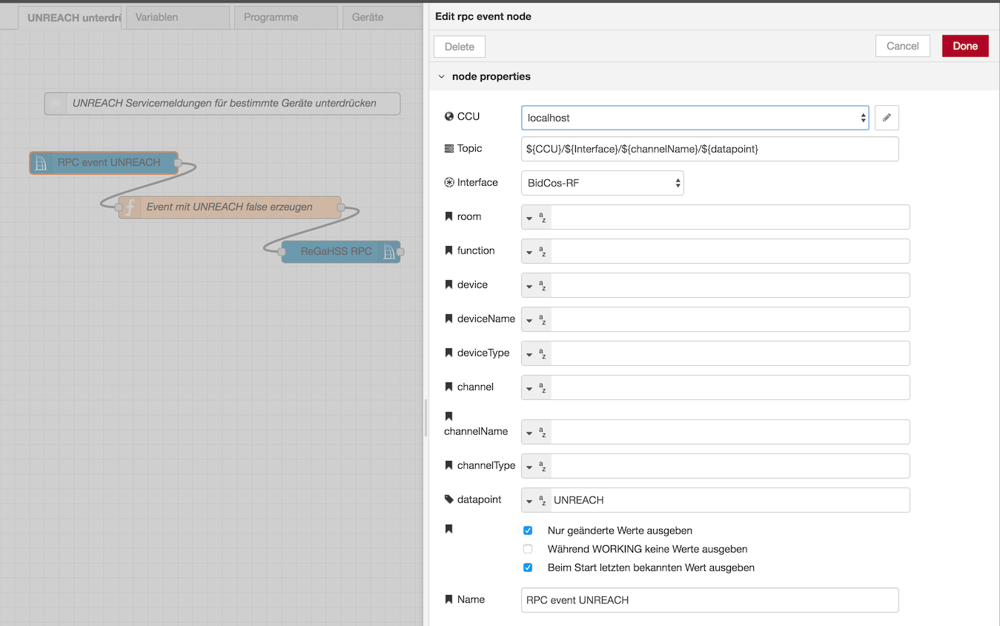
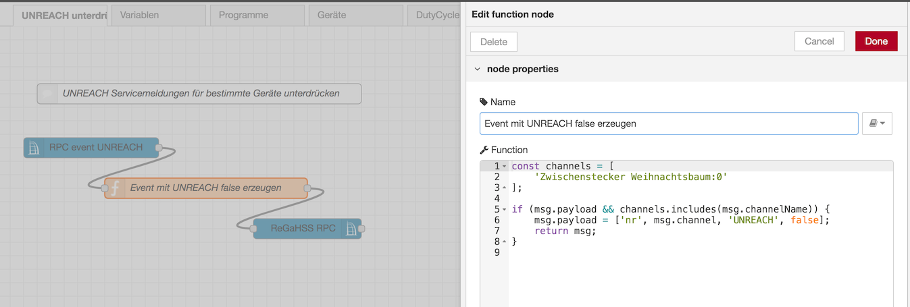
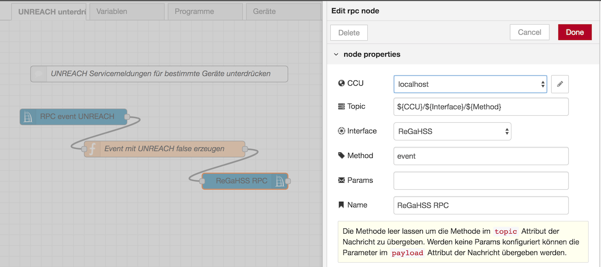

# UNREACH Servicemeldung unterdrücken

Leider gibt es (noch?) keine Möglichkeit an der CCU angelernte Aktoren zu deaktivieren, dies kann störend sein z.B. bei einen Zwischenstecker der nur für die Weihnachtsbaumbeleuchtung verwendet wird, 11 Monate im Jahr in der Schublade verbleibt und dann eine ständige `UNREACH` Servicemeldung erzeugt. Es ist zwar unmöglich diese Meldung zu bestätigen, allerdings gibt es die Möglichkeit der Logikschicht "vorzugaukeln" dass der Aktor wieder erreichbar ist. 

Folgender Flow reagiert auf `UNREACH` Events, prüft ob der Aktor in einer Liste von zu deaktivierenden Aktoren enthalten ist und sendet der Logikschicht einen "gefaketen" Event der die Meldung zurücksetzt.

### Nodes

#### rpc event



#### function



#### rpc 




### Flow JSON

```
[{"id":"d93ee77.7acbf18","type":"tab","label":"UNREACH unterdrücken","disabled":false,"info":""},{"id":"53c6bf49.7e356","type":"ccu-rpc-event","z":"d93ee77.7acbf18","name":"RPC event UNREACH","iface":"BidCos-RF","ccuConfig":"38263145.35ea0e","rooms":"","roomsRx":"str","functions":"","functionsRx":"str","device":"","deviceRx":"str","deviceName":"","deviceNameRx":"str","deviceType":"","deviceTypeRx":"str","channel":"","channelRx":"str","channelName":"","channelNameRx":"str","channelType":"","channelTypeRx":"str","datapoint":"UNREACH","datapointRx":"str","change":true,"cache":true,"topic":"${CCU}/${Interface}/${channelName}/${datapoint}","x":140,"y":180,"wires":[["de60fd20.e5bc9"]]},{"id":"de60fd20.e5bc9","type":"function","z":"d93ee77.7acbf18","name":"Event mit UNREACH false erzeugen","func":"const channels = [\n    'Zwischenstecker Weihnachtsbaum:0'\n];\n\nif (msg.payload && channels.includes(msg.channelName)) {\n    msg.payload = ['nr', msg.channel, 'UNREACH', false];\n    return msg;    \n}\n","outputs":1,"noerr":0,"x":310,"y":240,"wires":[["1625b35a.ee815d"]]},{"id":"1625b35a.ee815d","type":"ccu-rpc","z":"d93ee77.7acbf18","name":"ReGaHSS RPC","ccuConfig":"38263145.35ea0e","iface":"ReGaHSS","method":"event","params":"","topic":"${CCU}/${Interface}/${Method}","x":460,"y":300,"wires":[[]]},{"id":"6b8ec179.3a798","type":"comment","z":"d93ee77.7acbf18","name":"UNREACH Servicemeldungen für bestimmte Geräte unterdrücken","info":"","x":300,"y":100,"wires":[]},{"id":"38263145.35ea0e","type":"ccu-connection","z":"","name":"localhost","host":"localhost","regaEnabled":true,"bcrfEnabled":true,"iprfEnabled":true,"virtEnabled":true,"bcwiEnabled":false,"cuxdEnabled":true,"regaPoll":true,"regaInterval":"30","rpcPingTimeout":"60","rpcInitAddress":"127.0.0.1","rpcServerHost":"127.0.0.1","rpcBinPort":"2047","rpcXmlPort":"2048"}]
```