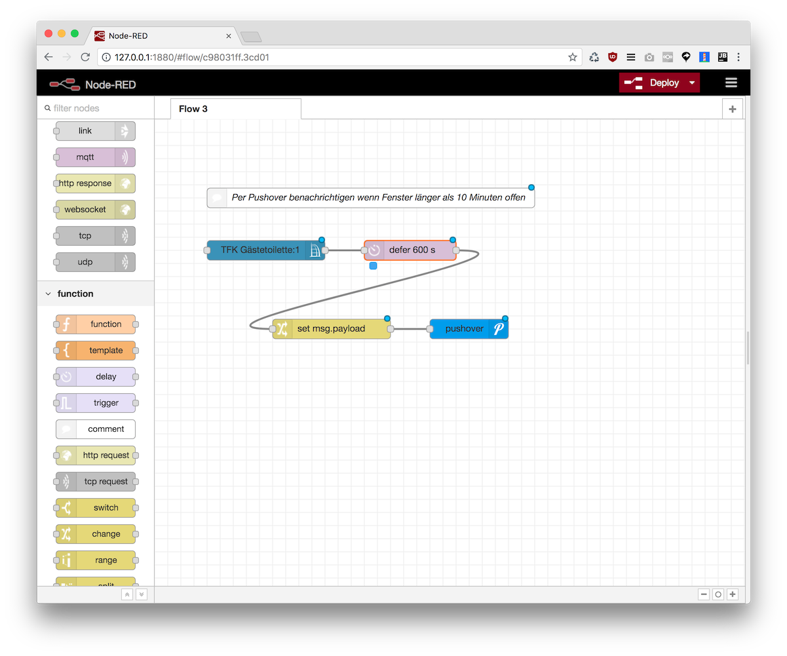

Dieser Flow sendet eine Benachrichtigung via Pushover wenn ein Fenster länger als 10 Minuten offen ist.




### Flow JSON

```
[{"id":"c98031ff.3cd01","type":"tab","label":"Flow 3","disabled":false,"info":""},{"id":"9c4e3f47.fa6ee","type":"ccu-value","z":"c98031ff.3cd01","name":"TFK Gästetoilette:1","iface":"HmIP-RF","channel":"0000D3C98C9233:1","datapoint":"STATE","mode":"","start":true,"change":true,"cache":true,"on":0,"onType":"undefined","ramp":0,"rampType":"undefined","working":false,"ccuConfig":"6fd15da9.a6e1e4","topic":"${CCU}/${Interface}/${channel}/${datapoint}","x":170,"y":200,"wires":[["26f6d1bf.3138ce"]]},{"id":"26f6d1bf.3138ce","type":"combine-defer","z":"c98031ff.3cd01","topic":"","name":"","defer":"600","x":390,"y":200,"wires":[["dbd058b8.bf9698"]]},{"id":"3967ea1e.15d7a6","type":"pushover api","z":"c98031ff.3cd01","keys":"f7e977b9.36d768","title":"Smart Home","name":"","x":480,"y":320,"wires":[]},{"id":"dbd058b8.bf9698","type":"change","z":"c98031ff.3cd01","name":"","rules":[{"t":"set","p":"payload","pt":"msg","to":"Fenster Gästetoilette seit mehr als 10 Minuten offen","tot":"str"}],"action":"","property":"","from":"","to":"","reg":false,"x":270,"y":320,"wires":[["3967ea1e.15d7a6"]]},{"id":"219d596d.68be66","type":"comment","z":"c98031ff.3cd01","name":"Per Pushover benachrichtigen wenn Fenster länger als 10 Minuten offen","info":"","x":330,"y":120,"wires":[]},{"id":"6fd15da9.a6e1e4","type":"ccu-connection","z":"","name":"localhost","host":"localhost","regaEnabled":true,"bcrfEnabled":true,"iprfEnabled":true,"virtEnabled":true,"bcwiEnabled":false,"cuxdEnabled":false,"regaPoll":true,"regaInterval":"30","rpcPingTimeout":"60","rpcInitAddress":"localhost","rpcServerHost":"localhost","rpcBinPort":"2062","rpcXmlPort":"2063"},{"id":"f7e977b9.36d768","type":"pushover-keys","z":"","name":"My Pushover Keys"}]
```