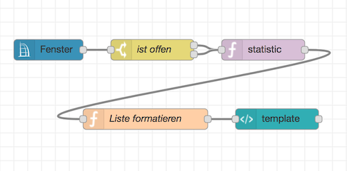
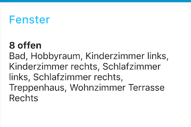
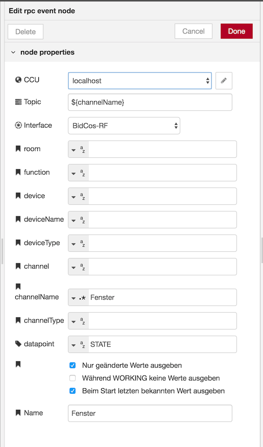
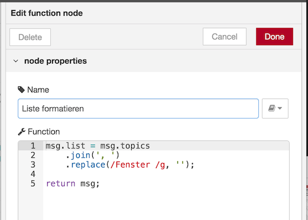
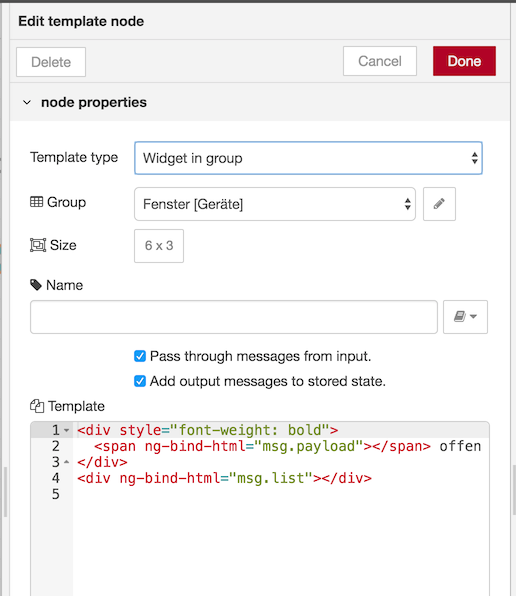

# Anzahl und Liste offener Fenster im Dashboard anzeigen


__** SORRY! Dieser Flow funktioniert nicht wie er soll. Korrigierte Version kommt ASAP **__




Das Ergebnis dieses Flows im Dashboard:    


## CCU RPC Event Node

Der RPC Event Node wird so konfiguriert, dass er alle Events von Geräten, in deren Kanal-Namen die Zeichenkette `Fenster` vorkommt und bei denen eine Änderung des Wertes des `STATE` Datenpunktes erfolgt ist ausgibt. Als Topic wird der Kanal-Name (`channelName`) ausgegeben, dies wird später verwendet um die Liste der offenen Fenster zu erzeugen.




## Switch Node

Ein Switch Node wird so konfiguriert dass er nur Nachrichten weiterleitet deren Payload `true` (TFK offen) bzw. größer als `0` (Drehgriffsensor auf offen oder kipp) ist.


## Combine Statistic Node

Der Statistic Node zählt die Anzahl offener Fenster und erzeugt ein Array in `msg.topics` das die jeweiligen Kanal-Namen beinhaltet.


## Function Node

Ein Function Node verbindet dass Array mit den Kanal-Namen der offenen Fenster zu einem Komma-getrennten String und entfernt die Zeichenkette `Fenster ` aus dieser Liste.




```javascript
msg.list = msg.topics
    .join(', ')
    .replace(/Fenster /g, '');
    
return msg;
```

## Dashboard Template Node

Zu guter Letzt wird ein Dashboard Template Node verwendet um die Anzahl und Liste der offenen Fenster anzuzeigen.




```html
<div style="font-weight: bold">
  <span ng-bind-html="msg.payload"></span> offen
</div>
<div ng-bind-html="msg.list"></div>
```


#### Flow JSON

```
[{"id":"5a42cf85.8405a","type":"tab","label":"Fenster","disabled":false,"info":""},{"id":"683cd0e.df3593","type":"ccu-rpc-event","z":"5a42cf85.8405a","name":"Fenster","iface":"BidCos-RF","ccuConfig":"38263145.35ea0e","rooms":"","roomsRx":"str","functions":"","functionsRx":"str","device":"","deviceRx":"str","deviceName":"","deviceNameRx":"str","deviceType":"","deviceTypeRx":"str","channel":"","channelRx":"str","channelName":"Fenster","channelNameRx":"re","channelType":"","channelTypeRx":"str","datapoint":"STATE","datapointRx":"str","change":true,"working":false,"cache":true,"topic":"${channelName}","x":110,"y":120,"wires":[["5962474e.a084b8"]]},{"id":"977003d8.c29ff","type":"combine-statistic","z":"5a42cf85.8405a","name":"","topic":"","operator":"len","defer":250,"timeout":0,"distinction":"topic","x":420,"y":120,"wires":[["1fbaf348.970e6d"]]},{"id":"5962474e.a084b8","type":"switch","z":"5a42cf85.8405a","name":"ist offen","property":"payload","propertyType":"msg","rules":[{"t":"true"},{"t":"gt","v":"0","vt":"num"}],"checkall":"true","repair":false,"outputs":2,"x":260,"y":120,"wires":[["977003d8.c29ff"],["977003d8.c29ff"]]},{"id":"56faaa2d.9f16b4","type":"ui_template","z":"5a42cf85.8405a","group":"c987989b.d46ad8","name":"","order":0,"width":"6","height":"3","format":"<div style=\"font-weight: bold\">\n  <span ng-bind-html=\"msg.payload\"></span> offen\n</div>\n<div ng-bind-html=\"msg.list\"></div>\n","storeOutMessages":true,"fwdInMessages":true,"templateScope":"local","x":440,"y":220,"wires":[[]]},{"id":"1fbaf348.970e6d","type":"function","z":"5a42cf85.8405a","name":"Liste formatieren","func":"msg.list = msg.topics\n    .join(', ')\n    .replace(/Fenster /g, '');\n    \nreturn msg;","outputs":1,"noerr":0,"x":250,"y":220,"wires":[["56faaa2d.9f16b4"]]},{"id":"38263145.35ea0e","type":"ccu-connection","z":"","name":"localhost","host":"localhost","regaEnabled":true,"bcrfEnabled":true,"iprfEnabled":true,"virtEnabled":true,"bcwiEnabled":false,"cuxdEnabled":false,"regaPoll":true,"regaInterval":"30","rpcPingTimeout":"60","rpcInitAddress":"127.0.0.1","rpcServerHost":"127.0.0.1","rpcBinPort":"2047","rpcXmlPort":"2048"},{"id":"c987989b.d46ad8","type":"ui_group","z":"","name":"Fenster","tab":"566b87c7.3046e8","disp":true,"width":"6","collapse":false},{"id":"566b87c7.3046e8","type":"ui_tab","z":"","name":"Geräte","icon":"dashboard","order":1}]
```