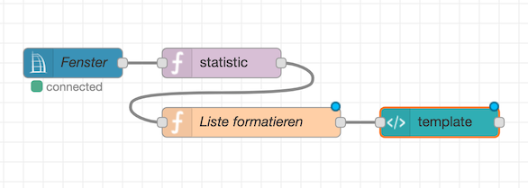
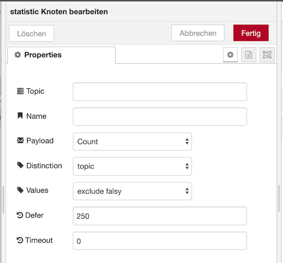

# Anzahl und Liste offener Fenster im Dashboard anzeigen





Das Ergebnis dieses Flows im Dashboard:    


## CCU RPC Event Node

Der RPC Event Node wird so konfiguriert, dass er alle Events von Geräten, in deren Kanal-Namen die Zeichenkette `Fenster` vorkommt und bei denen eine Änderung des Wertes des `STATE` Datenpunktes erfolgt ist ausgibt. Als Topic wird der Kanal-Name (`channelName`) ausgegeben, dies wird später verwendet um die Liste der offenen Fenster zu erzeugen.


## Combine Statistic Node

Der Statistic Node zählt die Anzahl offener Fenster und erzeugt ein Array in `msg.topics` das die jeweiligen Kanal-Namen beinhaltet. Damit nur geöffnete Fenster gezählt werden muss die Option `Values` auf `exclude falsy` gesetzt werden.




## Function Node

Ein Function Node verbindet dass Array mit den Kanal-Namen der offenen Fenster zu einem Komma-getrennten String und entfernt die Zeichenkette `Fenster ` aus dieser Liste.


```javascript
msg.list = msg.topics
    .join(', ')
    .replace(/Fenster /g, '');
    
return msg;
```

## Dashboard Template Node

Zu guter Letzt wird ein Dashboard Template Node verwendet um die Anzahl und Liste der offenen Fenster anzuzeigen.


```html
<div style="font-weight: bold">
  <span ng-bind-html="msg.payload"></span> offen
</div>
<div ng-bind-html="msg.list"></div>
```


#### Flow JSON

```
[{"id":"345ac839.d19018","type":"ccu-rpc-event","z":"9480c9ac.fecc08","name":"Fenster","iface":"BidCos-RF","ccuConfig":"38263145.35ea0e","rooms":"","roomsRx":"str","functions":"","functionsRx":"str","device":"","deviceRx":"str","deviceName":"","deviceNameRx":"str","deviceType":"","deviceTypeRx":"str","channel":"","channelRx":"str","channelName":"Fenster","channelNameRx":"re","channelType":"","channelTypeRx":"str","channelIndex":"","channelIndexRx":"str","datapoint":"STATE","datapointRx":"str","change":true,"working":false,"cache":true,"topic":"${channelName}","x":110,"y":120,"wires":[["ff240e0a.23914"]]},{"id":"ff240e0a.23914","type":"combine-statistic","z":"9480c9ac.fecc08","name":"","topic":"","operator":"len","falsy":"exclude","defer":250,"timeout":0,"distinction":"topic","x":260,"y":120,"wires":[["d5ea20f9.24f5b"]]},{"id":"d5ea20f9.24f5b","type":"function","z":"9480c9ac.fecc08","name":"Liste formatieren","func":"msg.list = msg.topics\n    .join(', ')\n    .replace(/Fenster /g, '');\n    \nreturn msg;","outputs":1,"noerr":0,"x":290,"y":180,"wires":[["fea2bb6.3f7f348"]]},{"id":"fea2bb6.3f7f348","type":"ui_template","z":"9480c9ac.fecc08","group":"95141880.9f2268","name":"","order":0,"width":"6","height":"3","format":"<div style=\"font-weight: bold\">\n  <span ng-bind-html=\"msg.payload\"></span> offen\n</div>\n<div ng-bind-html=\"msg.list\"></div>\n","storeOutMessages":true,"fwdInMessages":true,"templateScope":"local","x":480,"y":180,"wires":[[]]},{"id":"38263145.35ea0e","type":"ccu-connection","z":"","name":"localhost","host":"localhost","regaEnabled":true,"bcrfEnabled":true,"iprfEnabled":true,"virtEnabled":false,"bcwiEnabled":true,"cuxdEnabled":false,"regaPoll":true,"regaInterval":"30","rpcPingTimeout":"60","rpcInitAddress":"127.0.0.1","rpcServerHost":"127.0.0.1","rpcBinPort":"2047","rpcXmlPort":"2048","queueTimeout":"5000","queuePause":"250","contextStore":"default"},{"id":"95141880.9f2268","type":"ui_group","z":"","name":"Fenster","tab":"daf804b4.907128","disp":true,"width":"6","collapse":false},{"id":"daf804b4.907128","type":"ui_tab","z":"","name":"Geräte","icon":"dashboard","order":1}]
```