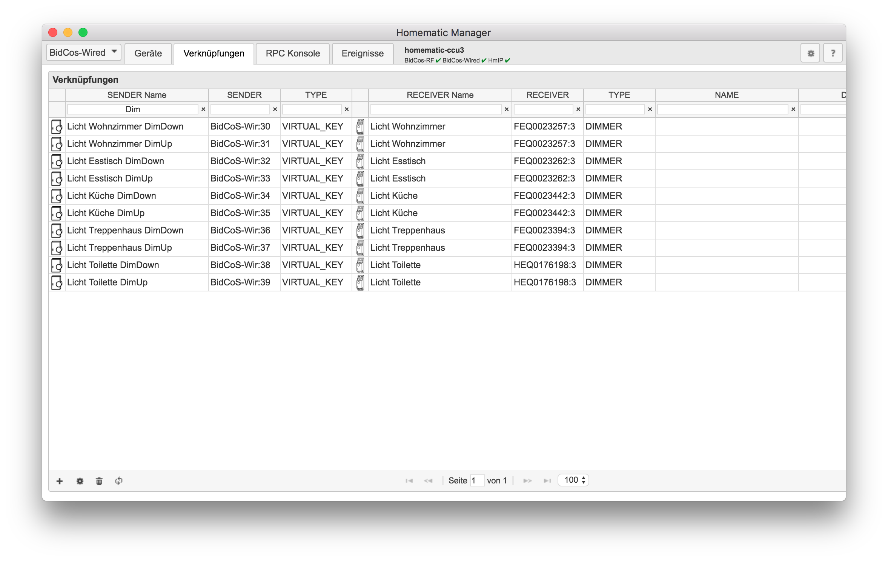
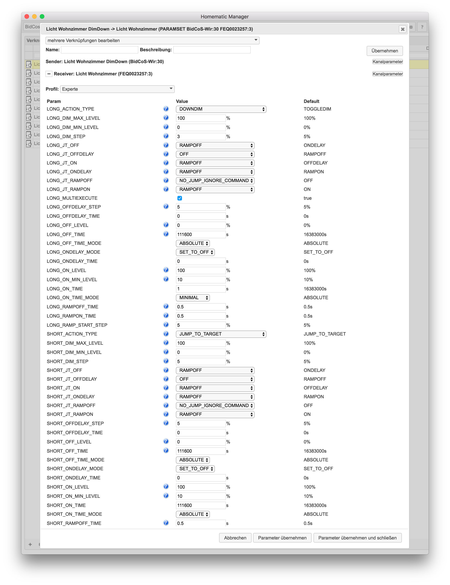
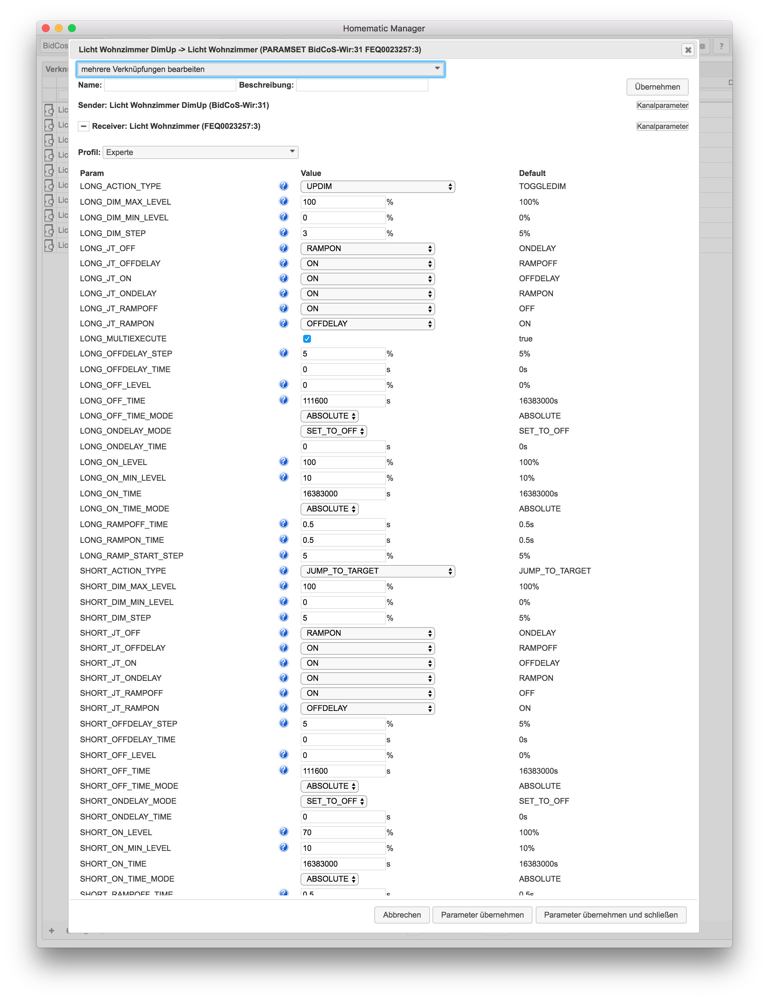
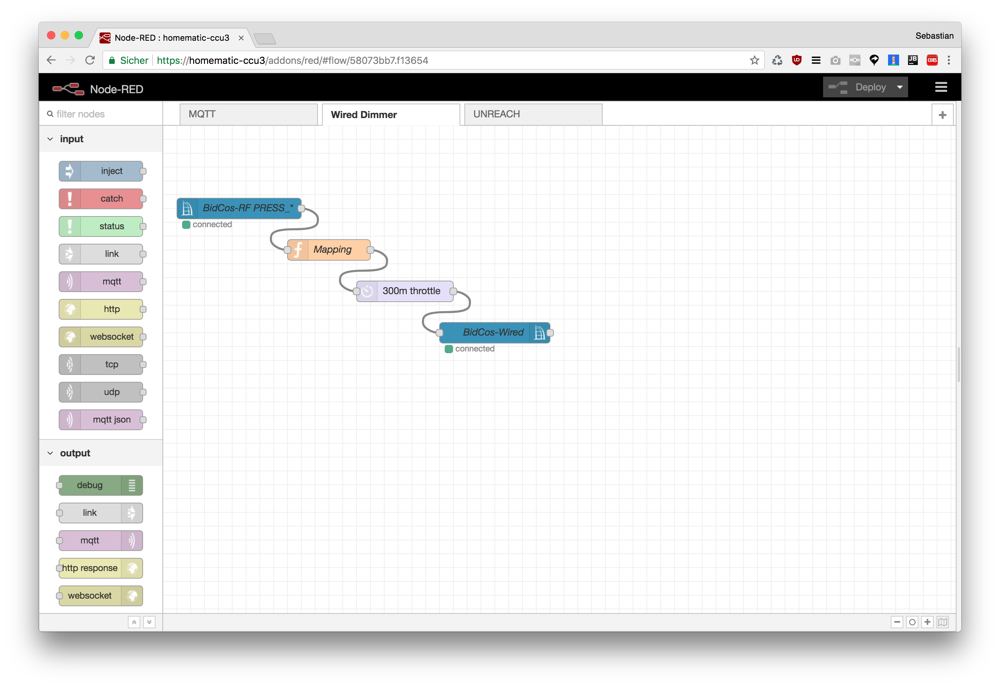
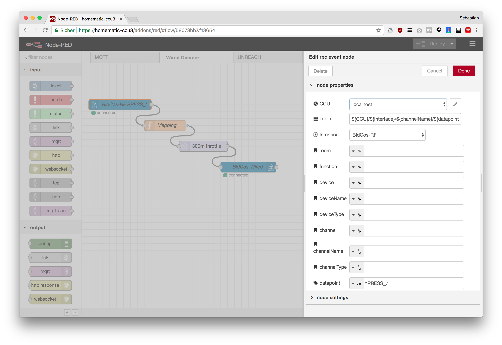
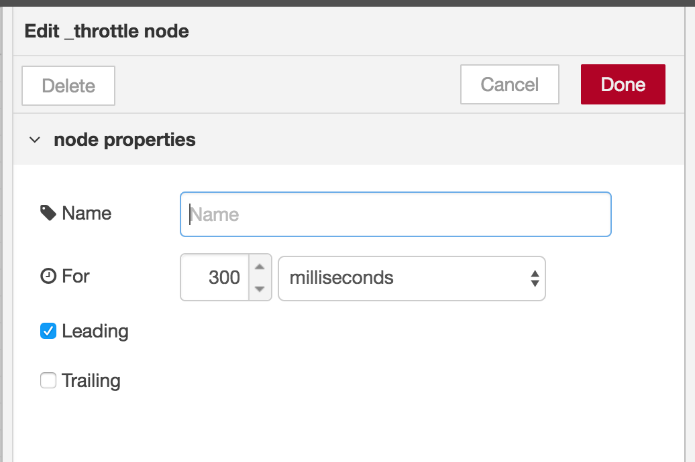
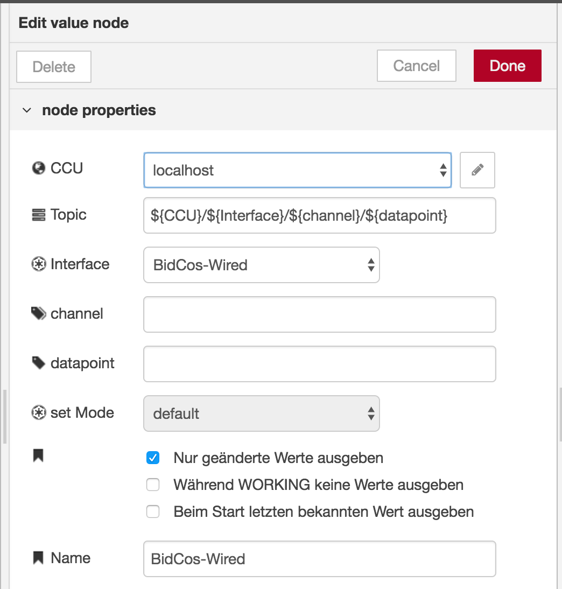

# Bidcos-Wired Dimmer mit Bidcos-RF Tasten steuern

Da sich Bidcos-Wired Dimmer nicht mit Funk-Fernbedienungen/Tastern Verknüpfen lassen ist es von Haus aus nicht möglich über langen Tastendruck auf und ab zu dimmen. Eine Lösung für dieses Problem ist die Verwendung von Direktverknüpfungen zwischen virtuellen Wired Tasten und den Dimmern die dann über die `PRESS_CONT` Events von Bidcos-RF Tasten angesteuert werden. Weitere wichtige Informationen zu den `PRESS_CONT` Events siehe Hinweis zu Tastendruckevents: https://github.com/rdmtc/RedMatic/wiki/Faq#bei-anhaltendem-tastendruck-werden-keine-press_cont-events-empfangen


### Direktverknüpfungen mit virtuellen Tasten

Zuerst müssen entsprechende Direktverknüpfungen angelegt werden, es ist jeweils eine virtuelle Taste für das hoch- und eine für das runter-dimmen notwendig:



In den Verknüpfungsprofil ist auf kurzen Tastendruck das an- bzw ausschalten konfiguriert, ein langer Tastendruck Dimmt um 3% hoch bzw. runter:




### Node-RED Flow

Der Flow der nun diese virtuellen Tasten "bedient" besteht aus 4 Nodes, einem `RPC Event` Node der alle BidCos-RF `PRESS_*` Events abonniert, einem `Function` Node der die Zuordnung der RF-Tasten zu den Wired-Verknüpfungen beinhaltet, einem `Throttle` Node (muss nachinstalliert werden: https://flows.nodered.org/node/node-red-contrib-throttle) der die Anzahl der Tastendrücke auf ~3 pro Sekunde limitiert und einem `Value` Node der schlussendlich den Tastendruck an den Wired-Schnittstellenprozess sendet.



#### CCU RPC Event Node

Es wird eine Filterung des Datenpunkts über einen Regulären Ausdruck vorgenommen um Events aller Datenpunkte zu erhalten die mit `PRESS_` beginnen



#### Function Node

```Javascript
const map = {
    'Displaytaster Säule:7': 'Licht Esstisch DimDown',
    'Displaytaster Säule:8': 'Licht Esstisch DimUp',
    'Displaytaster Säule:9': 'Licht Küche DimDown',
    'Displaytaster Säule:10': 'Licht Küche DimUp',
    "Displaytaster Säule:11": "Licht Wohnzimmer DimDown",
    "Displaytaster Säule:12": "Licht Wohnzimmer DimUp",
    "RC19:3": "Licht Wohnzimmer DimDown",
    "RC19:4": "Licht Wohnzimmer DimUp",
    'RC19:5': 'Licht Esstisch DimDown',
    'RC19:6': 'Licht Esstisch DimUp',
    'RC19:7': 'Licht Küche DimDown',
    'RC19:8': 'Licht Küche DimUp',
    'RC19:11': 'Licht Treppenhaus DimDown',
    'RC19:12': 'Licht Treppenhaus DimUp'
};
     
if (map[msg.channelName] && msg.datapoint.startsWith('PRESS_')) {
    let datapoint = msg.datapoint;
    if (datapoint === 'PRESS_CONT') {
        datapoint = 'PRESS_LONG';
    }
    msg = Object.assign({datapoint, payload: true}, {channelName: map[msg.channelName]});
    return msg;
}
```

#### Throttle Node



#### CCU Value Node 



### Flow JSON

```
[{"id":"58073bb7.f13654","type":"tab","label":"Wired Dimmer","disabled":false,"info":""},{"id":"4e9d1e2e.351c2","type":"function","z":"58073bb7.f13654","name":"Mapping","func":"const map = {\n    'Displaytaster Säule:7': 'Licht Esstisch DimDown',\n    'Displaytaster Säule:8': 'Licht Esstisch DimUp',\n    'Displaytaster Säule:9': 'Licht Küche DimDown',\n    'Displaytaster Säule:10': 'Licht Küche DimUp',\n    \"Displaytaster Säule:11\": \"Licht Wohnzimmer DimDown\",\n    \"Displaytaster Säule:12\": \"Licht Wohnzimmer DimUp\",\n    \"RC19:3\": \"Licht Wohnzimmer DimDown\",\n    \"RC19:4\": \"Licht Wohnzimmer DimUp\",\n    'RC19:5': 'Licht Esstisch DimDown',\n    'RC19:6': 'Licht Esstisch DimUp',\n    'RC19:7': 'Licht Küche DimDown',\n    'RC19:8': 'Licht Küche DimUp',\n    'RC19:11': 'Licht Treppenhaus DimDown',\n    'RC19:12': 'Licht Treppenhaus DimUp'\n};\n     \nif (map[msg.channelName] && msg.datapoint.startsWith('PRESS_')) {\n    let datapoint = msg.datapoint;\n    if (datapoint === 'PRESS_CONT') {\n        datapoint = 'PRESS_LONG';\n    }\n    if (msg.deviceType === 'HM-RC-19-SW' && datapoint === 'PRESS_LONG_RELEASE') {\n        datapoint = 'PRESS_LONG';\n    }\n\n    msg = Object.assign({datapoint, payload: true}, {channelName: map[msg.channelName]});\n\n    \n    return msg;\n}\n\n","outputs":1,"noerr":0,"x":380,"y":200,"wires":[["9b70f0e3.0fd94"]]},{"id":"3a48b857.604a68","type":"ccu-rpc-event","z":"58073bb7.f13654","name":"BidCos-RF PRESS_*","iface":"BidCos-RF","ccuConfig":"38263145.35ea0e","rooms":"","roomsRx":"str","functions":"","functionsRx":"str","device":"","deviceRx":"str","deviceName":"","deviceNameRx":"str","deviceType":"","deviceTypeRx":"str","channel":"","channelRx":"str","channelName":"","channelNameRx":"str","channelType":"","channelTypeRx":"str","datapoint":"^PRESS_.*","datapointRx":"re","change":false,"working":false,"cache":false,"topic":"${CCU}/${Interface}/${channelName}/${datapoint}","x":250,"y":140,"wires":[["4e9d1e2e.351c2"]]},{"id":"8477b989.505c08","type":"ccu-value","z":"58073bb7.f13654","name":"BidCos-Wired","iface":"BidCos-Wired","channel":"","datapoint":"","mode":"","start":true,"change":true,"cache":false,"on":0,"onType":"undefined","ramp":0,"rampType":"undefined","working":false,"ccuConfig":"38263145.35ea0e","topic":"${CCU}/${Interface}/${channel}/${datapoint}","x":620,"y":320,"wires":[[]]},{"id":"9b70f0e3.0fd94","type":"_throttle","z":"58073bb7.f13654","name":"","nbWaitUnits":"300","waitUnits":"milliseconds","leading":true,"trailing":false,"x":490,"y":260,"wires":[["8477b989.505c08"]]},{"id":"38263145.35ea0e","type":"ccu-connection","z":"","name":"localhost","host":"localhost","regaEnabled":true,"bcrfEnabled":true,"iprfEnabled":true,"virtEnabled":true,"bcwiEnabled":true,"cuxdEnabled":false,"regaPoll":true,"regaInterval":"30","rpcPingTimeout":"60","rpcInitAddress":"127.0.0.1","rpcServerHost":"127.0.0.1","rpcBinPort":"2047","rpcXmlPort":"2048","contextStore":""}]
```
