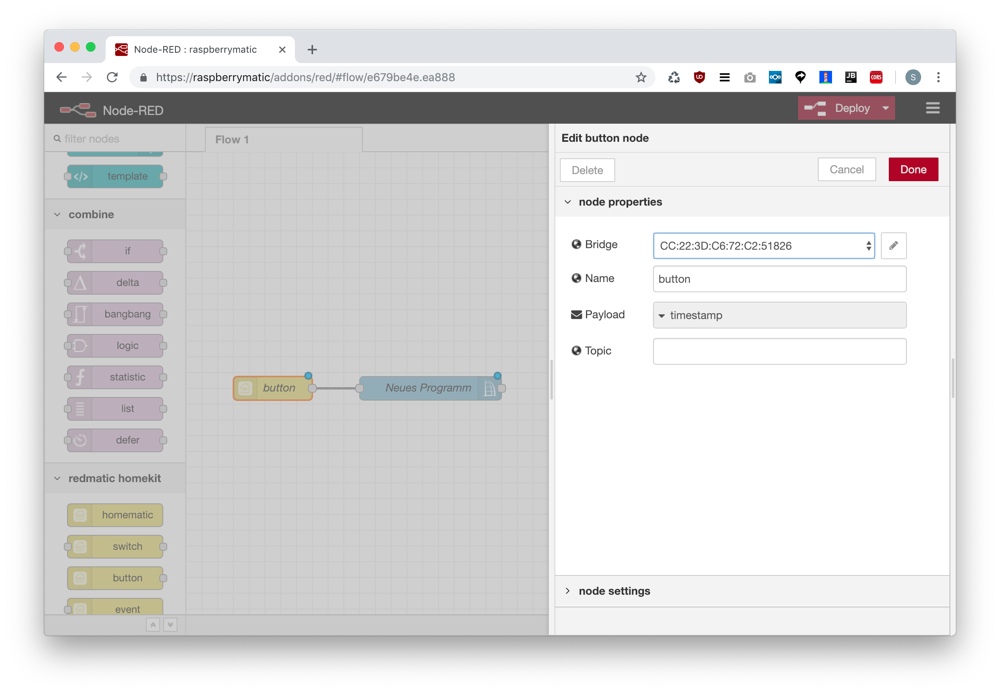

# RedMatic HomeKit

**Hinweis:** RedMatic HomeKit befindet sich noch in einem frühen Entwicklungsstadium und ist als Beta-Software zu betrachten. Es gibt noch einige Geräte die noch nicht unterstützt werden, es fehlen noch einige der geplanten Features, es sind wahrscheinlich noch einige Fehler enthalten (die im schlimmsten Fall zu einem Crash von Node-RED führen können und/oder ein löschen und erneutes Pairen der Bridge mit iOS erfordern). 
Einen Überblick über den Fortschritt der Entwicklung und geplante Features gibt es im [Issue Tracker](https://github.com/hobbyquaker/RedMatic-HomeKit/milestone/1). Bitte einen Issue anlegen falls die Implementierung bestimmter weiterer Homematic Geräte gewünscht ist. Die bereits unterstützen Geräte sind hier ersichtlich: https://github.com/hobbyquaker/RedMatic-HomeKit/tree/master/homematic-devices

## Inhalt

* [Einrichtung](#einrichtung)
* [Sytemvariablen](#systemvariablen)
* [CCU Programme starten](#programme)
* [Homematic Fernbedienungen/Tasten in HomeKit nutzen](#tasten)
* [Alarmsystem](#alarmsystem)

## Einrichtung

Den Node _RedMatic HomeKit - Homematic_ per Drag&Drop einem Flow hinzufügen    
    

Die Konfiguration des neu hinzugefügten Node per Doppelklick öffnen, den Button mit dem Bleistift-Icon anklicken um eine neue Bridge hinzuzufügen    
    

Die Standardeinstellungen können beibehalten werden, mit einem Klick auf den Button _Add_ wird die Bridge angelegt    
    

Die Konfiguration des _RedMatic HomeKit - Homematic_ mit klick auf _Done_ verlassen und dann den Button _Deploy_ anklicken     
    

Nochmals die Konfiguration des _RedMatic HomeKit - Homematic_ Node per Doppelklick öffnen und nochmal über den Bleistift-Button die Bridge-Konfiguration öffnen    
    

Bei einer erfolgreich aktivierten Bridge wird in dem Bridge Konfigurationsdialog nun ein QR-Code angezeigt    
    

In der Home App oben rechts über den Plus-Button ein neues Gerät hinzufügen, den QR-Code vom Bildschirm abscannen    
    

Die Sicherheitswarnung bestätigen    
    

Nun sollten alle unterstützen Geräte der CCU in der Home App erscheinen.

### Sytemvariablen

(Boolsche) Systemvariablen können über den _Redmatic HomeKit - Switch_ Node in HomeKit bereitgestellt werden. Hierzu werden die Ein- und Ausgänge eines _CCU Sysvar_ Nodes über kreuz mit dem _Redmatic HomeKit - Switch_ Node verbunden

### Programme

Leider werden bisher von der Home App und Siri keine Taster unterstützt die einen Einmaligen Event erzeugen. Als Workaround kann jedoch ein Schalter genutzt werden den man kurze Zeit nach dem Anschalten automatisch wieder ausschaltet. So können dann auch einmalige Events mit einem Klick in der Home App oder über Siri realiseren um z.B. ein Homematic Programm zu starten.

Man nutzt hierfür am Ausgang des _HomeKit Switch_ Nodes einen _Function Switch_ Node der die Nachrichten nur weiterleitet wenn `msg.payload` `true` ist. Den Ausgang dieses Nodes verbindet man dann mit einem _CCU Program_ Node und mit einem _Function Delay_ Node um eine Verzögerung beim Rücksetzen des Tasters zu realisieren. Ein _Function Change_ Node setzt dann `msg.payload` auf `false` und wird wieder an den Eingang des _Homekit Switch_ Nodes geführt.

_Für eine spätere Version von RedMatic-HomeKit ist eine Vereinfachung dieser "Pseudo-Button" Methode geplant indem direkt im Switch-Node schon ein automatischer Reset nach konfigurierbarer Zeit eingestellt werden kann._

### Tasten

Zum Auslösen von Aktionen in HomeKit über Homematic Fernbedienungen/Taster kann der Node _RedMatic HomeKit - Event_ genutzt werden. Er erwartet an seinem Eingang eine Message die in `msg.payload` die zu drückende Taste und die Art des Tastendrucks (kurz/lang) enthält, z.B. `1/PRESS_LONG` für einen langen Tastendruck auf Taste 1. Dieses Topic kann direkt vom RPC Event Node erzeugt werden in dem man die Topic-Konfiguration auf `${channelIndex}/${datapoint}` setzt und den Datenpunkt mit dem regulären Ausdruck `PRESS_SHORT|PRESS_LONG` filtert:

### Alarmsystem

