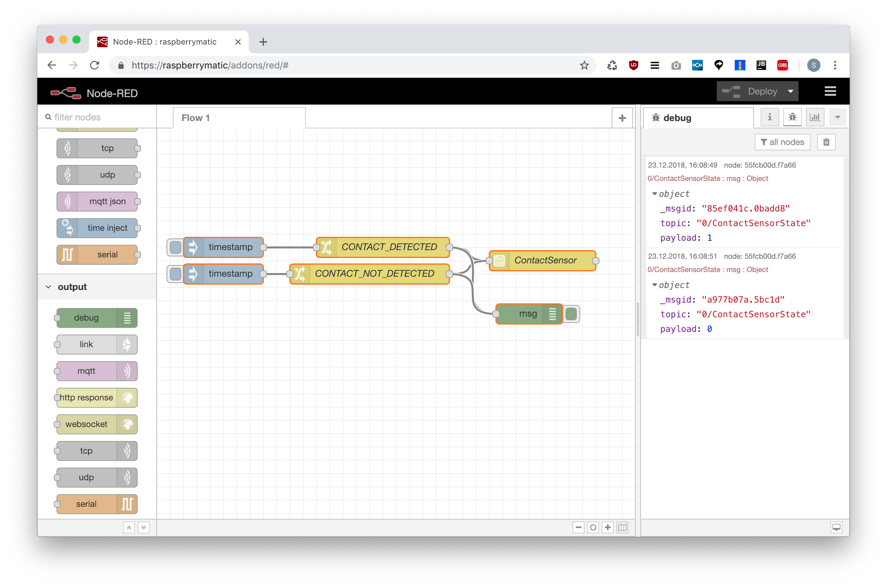

# RedMatic HomeKit

Bitte einen [Issue anlegen](https://github.com/hobbyquaker/RedMatic-HomeKit/issues) falls ein Gerät nicht unterstützt wird und gewünscht ist. Die bereits unterstützen Geräte sind hier ersichtlich: https://github.com/hobbyquaker/RedMatic-HomeKit/tree/master/homematic-devices

## Inhalt

* [Installation](#installation)
* [Einrichtung](#einrichtung)
* [Nutzungshinweise](#nutzungshinweise)
* [Homematic Fernbedienungen/Tasten in HomeKit nutzen](#tasten)
* [Systemvariablen](#systemvariablen)
* [CCU Programme starten](#programme)
* [Universelles Accessory, Einbinden von nicht-Homematic Geräten](#universal-accessory)
* [Camera Accessory, einbinden von Kameras](#camera-accessory)
* [HomeKit Reset](#reset)

## Installation

Im RedMatic UI (Erreichbar im CCU WebUI unter Einstellungen->Systemsteuerung) im Tab "Pakete" bei RedMatic-HomeKit auf den Install Button klicken, danach Node-RED neustarten.
 


## Einrichtung

Den Node _RedMatic HomeKit - Homematic_ per Drag&Drop einem Flow hinzufügen    
    

Die Konfiguration des neu hinzugefügten Node per Doppelklick öffnen, den Button mit dem Bleistift-Icon anklicken um eine neue Bridge hinzuzufügen    
    

Die Standardeinstellungen können beibehalten werden, mit einem Klick auf den Button _Add_ wird die Bridge angelegt    
   

Die Konfiguration des _RedMatic HomeKit - Homematic_ mit klick auf _Done_ verlassen und dann den Button _Deploy_ anklicken     
    

Nochmals die Konfiguration des _RedMatic HomeKit - Homematic_ Node per Doppelklick öffnen und nochmal über den Bleistift-Button die Bridge-Konfiguration öffnen    
    

Bei einer erfolgreich aktivierten Bridge wird in dem Bridge Konfigurationsdialog nun ein QR-Code angezeigt    
    

Der in der Bridge-Konfiguration angegebene Port (Default: `51826`) und der Port für den mDNS Dienst (`5353`) müssen in der CCU Firewall freigegeben werden (falls diese über die Firewall-Richtlinie "Ports blockiert" aktiviert ist). 


In der Home App oben rechts über den Plus-Button ein neues Gerät hinzufügen, den QR-Code vom Bildschirm abscannen    
    


Die Sicherheitswarnung bestätigen    
    


Nun sollten alle unterstützen Geräte der CCU in der Home App erscheinen.

### Nutzungshinweise

Nicht alle Änderungen an den in HomeKit bereitgestellten Accessories werden bei einem Deploy in Node-RED übernommen. Bestimmte Änderungen erfordern nach dem Deploy einen Neustart von RedMatic:

* Entfernen von Geräten
* Umbenennen von Geräten
* Konfigurationsänderung an Geräten (z.B. entfernen des Boost Switch bei Thermostaten)
* Ändern der Anzahl der Tasten des Event Nodes
* Die konfigurierten Services eines "Universellen Accessory" ändern


### Tasten

Zum Auslösen von Aktionen in HomeKit über Homematic Fernbedienungen/Taster kann der Node _RedMatic HomeKit - Event_ genutzt werden. Er erwartet an seinem Eingang eine Message die in `msg.topic` die zu drückende Taste und die Art des Tastendrucks (kurz/lang) enthält, z.B. `1/PRESS_LONG` für einen langen Tastendruck auf Taste 1. Dieses Topic kann direkt vom RPC Event Node erzeugt werden in dem man die Topic-Konfiguration auf `${channelIndex}/${datapoint}` setzt und den Datenpunkt mit dem regulären Ausdruck `PRESS_SHORT|PRESS_LONG` filtert:


### Systemvariablen

(Boolsche) Systemvariablen können über den _Redmatic HomeKit - Switch_ Node in HomeKit bereitgestellt werden. Hierzu werden die Ein- und Ausgänge eines _CCU Sysvar_ Nodes über kreuz mit dem _Redmatic HomeKit - Switch_ Node verbunden


### Programme

Leider werden bisher von der Home App und Siri keine Taster unterstützt die einen Einmaligen Event erzeugen. Als Workaround steht mit dem _redmatic homekit - button_ Node ein Schalter zur Verfügung der sich automatisch nach dem Anschalten zurücksetzt und so als "Pseudobutton" genutzt werden kann.

Dieser kann einfach mit einem _ccu - program_ Node verbunden werden, als _Payload_ wird `timestamp` ausgewählt:


### Universal Accessory

Mit dem Universal Accessory ist es möglich beliebige HomeKit-Geräte zu erzeugen, z.B. um damit auch Geräte abseits von Homematic einzubinden.

Dem Accessory können beliebig viele Services hinzugefügt werden. Siehe dazu auch https://github.com/rdmtc/RedMatic-HomeKit/issues/44

Verfügbare Services sowie die dafür benötigten und optionalen Characteristiken sind in dieser Datei ersichtlich: https://github.com/KhaosT/HAP-NodeJS/blob/master/lib/gen/HomeKitTypes.js

Um eine optionale Characteristic anzulegen müssen dem Accessory direkt beim Start (z.B. über einen _Inject_ Node) Messages gesendet werden. 

#### Beispiel

Es soll ein Accessory mit einem _ContactSensor_ Service angelegt werden. Die `0` vor dem Service gibt den "Subtype" an, dieser wird später benötigt um diesen Service anzusprechen.


Aus https://github.com/KhaosT/HAP-NodeJS/blob/master/lib/gen/HomeKitTypes.js ist ersichtlich dass der Service _ContactSensor_ eine Charakteristik _ContactSensorState_ benötigt:


In der Definition dieser Charakteristik ist ersichtlich dass diese den Wert `0` annehmen muss um einen geschlossenen Kontakt zu signalisieren und den Wert `1` um einen offenen Kontakt zu melden:


Um nun einen geschlossenen Kontakt zu melden muss dem Node eine Message geschickt werden deren `msg.topic` Property sich durch den "Subtype" (siehe oben) und den Namen der Characteristik zusammensetzt, getrennt durch einen Slash: `0/ContactSensorState`. 
Die Property `msg.payload` muss in diesem Fall auf die Number `0` gesetzt werden. Um diese beiden Properties der Message zu setzen kann ein _Change_ Node genutzt werden:




##### Flow JSON

```
[{"id":"f3c1ee32.c1bdf","type":"redmatic-homekit-universal","z":"e679be4e.ea888","bridgeConfig":"505f657d.84710c","name":"ContactSensor","services":[{"subtype":"0","service":"ContactSensor","name":"Test"}],"x":580,"y":240,"wires":[[]]},{"id":"26ae9d08.5d6242","type":"change","z":"e679be4e.ea888","name":"CONTACT_DETECTED","rules":[{"t":"set","p":"payload","pt":"msg","to":"0","tot":"num"},{"t":"set","p":"topic","pt":"msg","to":"0/ContactSensorState","tot":"str"}],"action":"","property":"","from":"","to":"","reg":false,"x":340,"y":220,"wires":[["f3c1ee32.c1bdf","55fcb00d.f7a66"]]},{"id":"70eea6a6.faf3f8","type":"change","z":"e679be4e.ea888","name":"CONTACT_NOT_DETECTED","rules":[{"t":"set","p":"payload","pt":"msg","to":"1","tot":"num"},{"t":"set","p":"topic","pt":"msg","to":"0/ContactSensorState","tot":"str"}],"action":"","property":"","from":"","to":"","reg":false,"x":320,"y":260,"wires":[["f3c1ee32.c1bdf","55fcb00d.f7a66"]]},{"id":"92689c97.a698c","type":"inject","z":"e679be4e.ea888","name":"","topic":"","payload":"","payloadType":"date","repeat":"","crontab":"","once":false,"onceDelay":0.1,"x":100,"y":220,"wires":[["26ae9d08.5d6242"]]},{"id":"7cbf7fe8.59d9","type":"inject","z":"e679be4e.ea888","name":"","topic":"","payload":"","payloadType":"date","repeat":"","crontab":"","once":false,"onceDelay":0.1,"x":100,"y":260,"wires":[["70eea6a6.faf3f8"]]},{"id":"55fcb00d.f7a66","type":"debug","z":"e679be4e.ea888","name":"","active":true,"tosidebar":true,"console":false,"tostatus":false,"complete":"true","x":560,"y":320,"wires":[]},{"id":"505f657d.84710c","type":"redmatic-homekit-bridge","z":"","name":"RedMatic Test Bridge","username":"CC:22:3D:00:F6:05","pincode":"964-84-514","port":"51826"}]
```

### Camera Accessory

Anleitung von nicolas-eric: https://github.com/rdmtc/RedMatic/wiki/Homekit-Kamera-einbinden

Siehe auch:
* https://github.com/rdmtc/RedMatic-HomeKit/issues/125#issuecomment-466550728
* [Homematic-Forum - Homekit Popup Bild bei Bewegung](https://homematic-forum.de/forum/viewtopic.php?f=77&t=50935)

### Reset

Um die Bridge im Fall von schwerwiegenden Problemen ("sollte" nicht passieren, aber man weiss ja nie 😉) komplett zurückzusetzen kann wie folgt vorgegangen werden:

* Bridge in iOS Home App löschen
* RedMatic stoppen
* Auf der CCU das Verzeichnis `/usr/local/addons/redmatic/var/homekit` mitsamt Inhalt löschen
* RedMatic starten

Hierbei gehen alle Raum-Zuordnungen sowie Umbenennungen in HomeKit verloren!