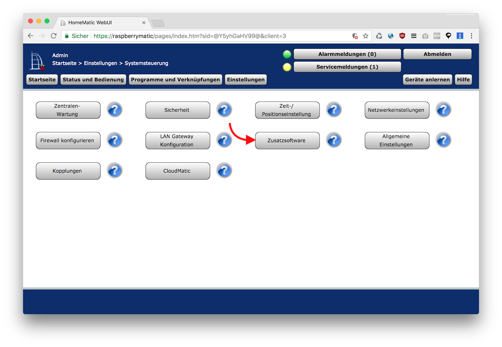
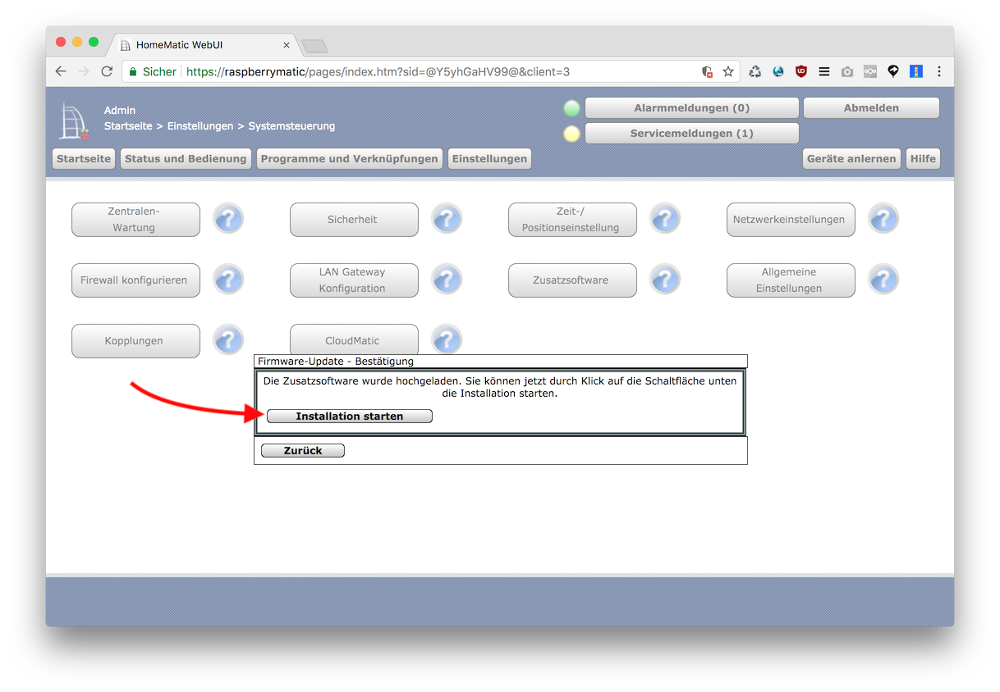

* Zur Sicherheit __ein Backup der CCU anfertigen__.
* Neueste Version von https://github.com/rdmtc/RedMatic/releases/latest herunterladen. Es wird die Datei 
`redmatic-<version>.tar.gz` benötigt: 
* Im Homematic WebUI Systemsteuerung Zusatzsoftware aufrufen:  
* Heruntergeladene Datei auswählen:  
* Datei auf die CCU hochladen: 
* Installation Starten: 
* Im Anschluss abwarten bis sich die CCU neu gestartet hat - hier ist Geduld erforderlich. Die Installation von RedMatic benötigt einige Zeit.
* Node-RED ist unter `http://<ccu-adresse>/addons/red` erreichbar.
* Node-RED Dashboard ist unter `http://<ccu-adresse>/addons/red/ui` erreichbar.

### CUxD und Homematic-Wired

Per Default werden die Schnittstellenprozesse CUxD und hs485d (wired) nicht aktiviert. Für eine Zukünftige Version ist dies geplant (https://github.com/hobbyquaker/RedMatic/issues/34), Stand heute muss das noch manuell im _ccu configuration_ Node gemacht werden.
Zur Aktivierung dieser muss in der [ccu-connection node](https://github.com/rdmtc/RedMatic/wiki/CCU-Nodes#ccu-connection-node) der entsprechende Haken gesetzt werden, die Änderung gespeichert werden und die Änderung deployed werden.