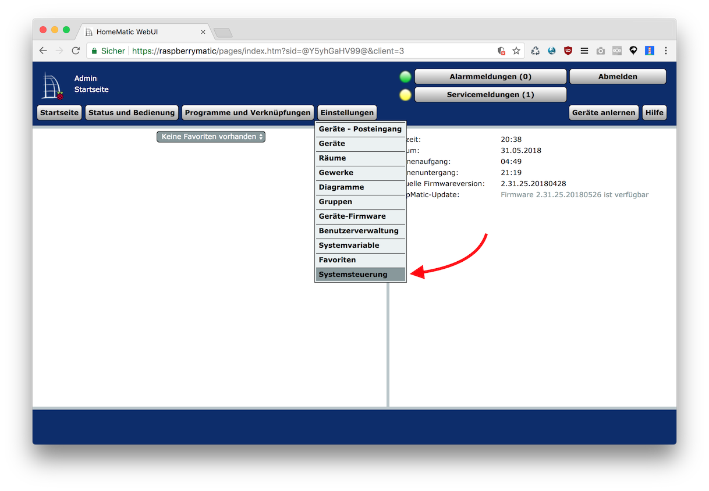

* Neueste Version von https://github.com/hobbyquaker/RedMatic/releases/latest herunterladen. Es wird die Datei 
`redmatic-<version>.tar.gz` benötigt: 
* Im Homematic WebUI Systemsteuerung Zusatzsoftware aufrufen:  
