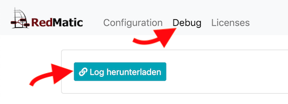

### Node-RED Log-Level anpassen

Zur Fehleranalyse und um ein Log für Supportanfragen zu generieren den Loglevel auf `debug` erhöhen:

* Im CCU WebUI unter Einstellungen-Systemsteuerung-RedMatic auf den Reiter Debug klicken
* Log Level auf `debug` setzen. (Für Supportanfragen _nicht_ auf Level `trace` loggen!).
* Node-RED neu starten

### Log herunterladen

RedMatic loggt in das CCU Syslog (`/var/log/messages`), im UI kann das Log (gefiltert auf Meldungen von RedMatic/Node-RED) heruntergeladen werden:

