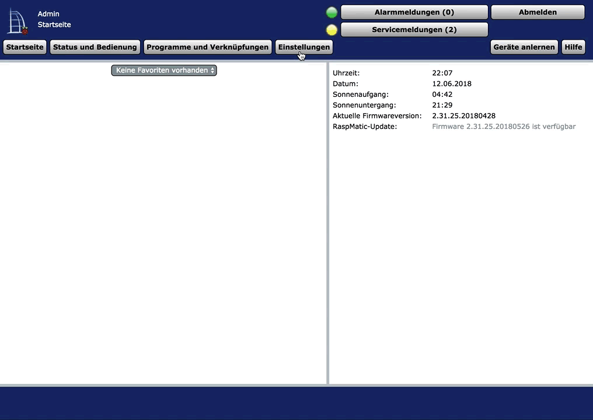

### Node-RED Log-Level anpassen

Zur Fehleranalyse ist es hilfreich den Loglevel zu erhöhen:

* Im CCU WebUI unter Einstellungen-Systemsteuerung-RedMatic auf den Reiter Debug klicken
* Log Level auf `debug` setzen
* Node-RED neu starten

Das Node-RED Log ist im CCU Syslog zu finden (`/var/log/messages`). 

