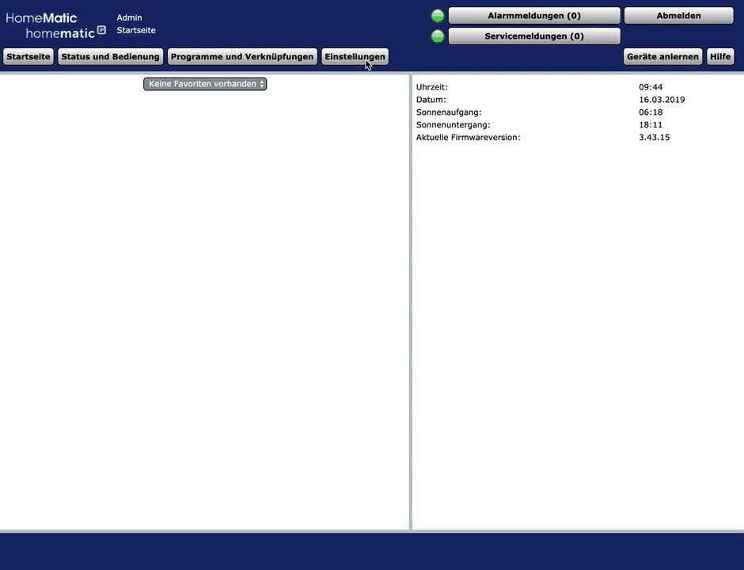

### Node-RED Log-Level anpassen

Zur Fehleranalyse ist es hilfreich den Loglevel zu erhöhen:

* Unter Systemsteuerung Zusatzsoftware Redmatic die Konfigurationsseite aufrufen (Button "Einstellen")
* Log Level auf `debug` oder `trace` setzen
* Node-RED neu starten

Das Node-RED Log ist im CCU Syslog zu finden (`/var/log/messages`).

