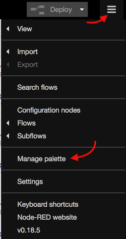

# Zusätzliche Node-RED Nodes

Node-RED kann durch zusätzliche _Nodes_ erweitert werden, eine große und aktive Community hat Stand Heute bereits weit über 1000 Nodes entwickelt die unterschiedlichste Anwendungsfälle abdecken und diverse Services und Systeme an Node-RED anbinden.

* [Verzeichnis aller verfügbarer Nodes auf nodered.org](https://flows.nodered.org/?type=node&num_pages=1)
* [Erfolgreich auf RedMatic getestete Nodes (bitte ergänzen!)](Erfolgreich-getestete-Nodes)

Nicht alle Nodes lassen sich auf einer CCU installieren. Es gibt Nodes die bei der Installation Binärmodule compilieren 
müssen, dies ist auf der CCU bzw. RaspberryMatic nicht praktikabel machbar (Buildroot ist nicht dafür vorgesehen die 
dafür notwendigen Tools wie z.B. gcc zu installieren). Dies betrifft u.A. Nodes die Zugriff auf Hardware (z.B. 
Bluetooth) benötigen. Falls der Wunsch besteht bestimmte Nodes zu nutzen die sich nicht installieren lassen kann gerne 
ein [Issue](https://github.com/hobbyquaker/ccu-addon-node-red/issues) angelegt werden, es ist dann u.U. möglich die 
Nodes mit vorab gebauten Binärmodulen mit in das CCU Addon Paket aufzunehmen.

## Backup

Zur Sicherheit vor dem Installieren zusätzlicher Nodes ein Backup der CCU anlegen!

## Installation via Node-RED Admin UI




## Installation via Command Line

```
export PATH=/usr/local/addons/redmatic/bin:$PATH
cd /usr/local/addons/redmatic/var
npm install --save  --save-prefix="~" --production <paket-name>
```


