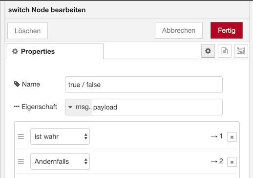

Nutzung des kostenlosen/spendenfinanzierten Service [Node-RED Smart Home Control](https://red.cb-net.co.uk/) zur Anbindung an Alexa (und Google Assistant bzw. Google Home).

# Einrichtung

1) Account Anlegen auf https://red.cb-net.co.uk/new-user und Email Verifizierung durchführen.
2) In Alexa App den Skill `Node-RED Smart Home Control` von cb-net hinzufügen und mit den in Schritt 1 verwendeten Zugangsdaten verbinden.
3) Über den Node-RED Palette Manager die Nodes `node-red-contrib-alexa-smart-home` installieren (siehe [Zusätzliche Nodes installieren](https://github.com/rdmtc/RedMatic/wiki/Node-Installation))

# Geräte Anlegen

Jedes Gerät das man verwenden möchte muss unter https://red.cb-net.co.uk/devices angelegt werden. Danach muss man Alexa mit der Aufforderung "Suche Geräte" (oder über die App) diese neuen Geräte einbinden lassen.

# Beispielflows

* [Fensterkontakt](#Fensterkontakt)
* [Schaltaktor](#Schaltaktor)
* [Rollladen](#Rollladen)
* [Dimmer](#Dimmer)
* [Thermostat](#Thermostat)
* [Keymatic](#Keymatic)
* [Szenen](#Szenen)

## Fensterkontakt

Als Alexa Gerät wird ein "Contact Sensor" verwendet:


Ein _CCU Value_ Node wird auf den Datenpunkt `STATE` des Kanals 1 des Fensterkontakts konfiguriert:


Dieser Node gibt je nach Zustand des Fensterkontakts bool `true` oder `false` als `msg.payload` aus. Der Alexa Service erwartet jedoch folgende `msg`: `{"acknowledge": true, "payload": {"state": {"contact": "DETECTED"}}}` bzw. `{"acknowledge": true, "payload": {"state": {"contact": "NOT_DETECTED"}}}`, es ist also eine Transformation der Nachricht notwendig damit diese vom Alexa Node genutzt werden kann. Dies kann mit einem Switch und 2 Change Nodes durchgeführt werden:





Am Ende des Flows kommt der Node _alexa smart home v3 state_ zum Einsatz:


#### Flow JSON
```
[{"id":"bb53c7a1.97ef48","type":"ccu-value","z":"6946acad.eb0ca4","name":"","iface":"BidCos-RF","channel":"JEQ0001234:1 Fenster Hobbyraum","datapoint":"STATE","mode":"","start":true,"change":true,"cache":true,"queue":false,"on":0,"onType":"undefined","ramp":0,"rampType":"undefined","working":true,"ccuConfig":"","topic":"${CCU}/${Interface}/${channel}/${datapoint}","x":140,"y":100,"wires":[["9ca4689c.4bce18"]]},{"id":"59e1c4a.2fe113c","type":"alexa-smart-home-v3-state","z":"6946acad.eb0ca4","conf":"","device":"10277","name":"Fenster Hobbyraum","x":800,"y":100,"wires":[]},{"id":"9ca4689c.4bce18","type":"switch","z":"6946acad.eb0ca4","name":"true / false","property":"payload","propertyType":"msg","rules":[{"t":"true"},{"t":"else"}],"checkall":"true","repair":false,"outputs":2,"x":350,"y":100,"wires":[["57e1e99e.5fc1f8"],["7bb89d62.7f3b04"]]},{"id":"57e1e99e.5fc1f8","type":"change","z":"6946acad.eb0ca4","name":"","rules":[{"t":"set","p":"payload","pt":"msg","to":"{\"state\":{\"contact\":\"DETECTED\"}}","tot":"json"},{"t":"set","p":"acknowledge","pt":"msg","to":"true","tot":"bool"}],"action":"","property":"","from":"","to":"","reg":false,"x":540,"y":80,"wires":[["59e1c4a.2fe113c"]]},{"id":"7bb89d62.7f3b04","type":"change","z":"6946acad.eb0ca4","name":"","rules":[{"t":"set","p":"payload","pt":"msg","to":"{\"state\":{\"contact\":\"NOT_DETECTED\"}}","tot":"json"},{"t":"set","p":"acknowledge","pt":"msg","to":"true","tot":"bool"}],"action":"","property":"","from":"","to":"","reg":false,"x":540,"y":120,"wires":[["59e1c4a.2fe113c"]]}]
```

## Schaltaktor

... todo


## Rollladen

... todo


## Dimmer

... todo


## Thermostat

... todo


## Keymatic

... todo


## Szenen

... todo