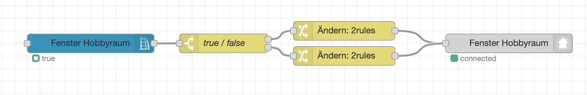
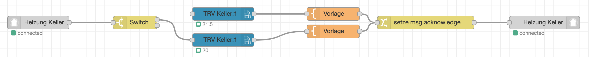

Nutzung des kostenlosen/spendenfinanzierten Service [Node-RED Smart Home Control](https://red.cb-net.co.uk/) zur Anbindung an Alexa (und Google Assistant bzw. Google Home).

# Einrichtung

1) Account Anlegen auf https://red.cb-net.co.uk/new-user und Email Verifizierung durchführen.
2) In Alexa App den Skill `Node-RED Smart Home Control` von cb-net hinzufügen und mit den in Schritt 1 verwendeten Zugangsdaten verbinden.
3) Über den Node-RED Palette Manager die Nodes `node-red-contrib-alexa-smart-home` installieren (siehe [Zusätzliche Nodes installieren](https://github.com/rdmtc/RedMatic/wiki/Node-Installation))

# Geräte Anlegen

Jedes Gerät das man verwenden möchte muss unter https://red.cb-net.co.uk/devices angelegt werden. Danach muss man Alexa mit der Aufforderung "Suche Geräte" (oder über die App) diese neuen Geräte einbinden lassen.

# Beispielflows

* [Fensterkontakt](#Fensterkontakt)
* [Schaltaktor](#Schaltaktor)
* [Rollladen](#Rollladen)
* [Dimmer](#Dimmer)
* [Thermostat](#Thermostat)
* [Keymatic](#Keymatic)
* [Szenen](#Szenen)

## Fensterkontakt

Als Alexa Gerät wird ein "Contact Sensor" verwendet:


Ein _CCU Value_ Node wird auf den Datenpunkt `STATE` des Kanals 1 des Fensterkontakts konfiguriert:


Dieser Node gibt je nach Zustand des Fensterkontakts bool `true` oder `false` als `msg.payload` aus. Der Alexa Service erwartet jedoch folgende `msg`: `{"acknowledge": true, "payload": {"state": {"contact": "DETECTED"}}}` bzw. `{"acknowledge": true, "payload": {"state": {"contact": "NOT_DETECTED"}}}`, es ist also eine Transformation der Nachricht notwendig damit diese vom Alexa Node genutzt werden kann. Dies kann mit einem Switch und 2 Change Nodes durchgeführt werden:


Am Ende des Flows kommt der Node _alexa smart home v3 state_ zum Einsatz:



#### Flow JSON
```
[{"id":"bb53c7a1.97ef48","type":"ccu-value","z":"6946acad.eb0ca4","name":"","iface":"BidCos-RF","channel":"JEQ0001234:1 Fenster Hobbyraum","datapoint":"STATE","mode":"","start":true,"change":true,"cache":true,"queue":false,"on":0,"onType":"undefined","ramp":0,"rampType":"undefined","working":true,"ccuConfig":"","topic":"${CCU}/${Interface}/${channel}/${datapoint}","x":140,"y":100,"wires":[["9ca4689c.4bce18"]]},{"id":"59e1c4a.2fe113c","type":"alexa-smart-home-v3-state","z":"6946acad.eb0ca4","conf":"","device":"10277","name":"Fenster Hobbyraum","x":800,"y":100,"wires":[]},{"id":"9ca4689c.4bce18","type":"switch","z":"6946acad.eb0ca4","name":"true / false","property":"payload","propertyType":"msg","rules":[{"t":"true"},{"t":"else"}],"checkall":"true","repair":false,"outputs":2,"x":350,"y":100,"wires":[["57e1e99e.5fc1f8"],["7bb89d62.7f3b04"]]},{"id":"57e1e99e.5fc1f8","type":"change","z":"6946acad.eb0ca4","name":"","rules":[{"t":"set","p":"payload","pt":"msg","to":"{\"state\":{\"contact\":\"DETECTED\"}}","tot":"json"},{"t":"set","p":"acknowledge","pt":"msg","to":"true","tot":"bool"}],"action":"","property":"","from":"","to":"","reg":false,"x":540,"y":80,"wires":[["59e1c4a.2fe113c"]]},{"id":"7bb89d62.7f3b04","type":"change","z":"6946acad.eb0ca4","name":"","rules":[{"t":"set","p":"payload","pt":"msg","to":"{\"state\":{\"contact\":\"NOT_DETECTED\"}}","tot":"json"},{"t":"set","p":"acknowledge","pt":"msg","to":"true","tot":"bool"}],"action":"","property":"","from":"","to":"","reg":false,"x":540,"y":120,"wires":[["59e1c4a.2fe113c"]]}]
```

## Schaltaktor

... todo


#### Flow JSON

```
[{"id":"819a38a8.d26cd8","type":"alexa-smart-home-v3","z":"6946acad.eb0ca4","conf":"e904a268.f4155","device":"10274","acknowledge":true,"name":"Licht Werkstatt","topic":"","x":120,"y":140,"wires":[["7622c428.dad7ac"]]},{"id":"7622c428.dad7ac","type":"switch","z":"6946acad.eb0ca4","name":"\"ON\"/\"OFF\"","property":"payload","propertyType":"msg","rules":[{"t":"eq","v":"ON","vt":"str"},{"t":"else"}],"checkall":"true","repair":false,"outputs":2,"x":310,"y":140,"wires":[["af3ee014.ef269"],["fe2b057b.2cd088"]]},{"id":"af3ee014.ef269","type":"change","z":"6946acad.eb0ca4","name":"","rules":[{"t":"set","p":"payload","pt":"msg","to":"true","tot":"bool"}],"action":"","property":"","from":"","to":"","reg":false,"x":510,"y":120,"wires":[["25df98dd.64fad8"]]},{"id":"fe2b057b.2cd088","type":"change","z":"6946acad.eb0ca4","name":"","rules":[{"t":"set","p":"payload","pt":"msg","to":"false","tot":"bool"}],"action":"","property":"","from":"","to":"","reg":false,"x":510,"y":160,"wires":[["25df98dd.64fad8"]]},{"id":"25df98dd.64fad8","type":"ccu-value","z":"6946acad.eb0ca4","name":"","iface":"HmIP-RF","channel":"000D1709A5915B:10 Licht Werkstatt","datapoint":"STATE","mode":"","start":true,"change":true,"cache":true,"queue":false,"on":0,"onType":"undefined","ramp":0,"rampType":"undefined","working":true,"ccuConfig":"38263145.35ea0e","topic":"${CCU}/${Interface}/${channel}/${datapoint}","x":730,"y":140,"wires":[["b6884af3.03f4d8"]]},{"id":"e503e79e.7e0df8","type":"alexa-smart-home-v3-state","z":"6946acad.eb0ca4","conf":"e904a268.f4155","device":"10274","name":"Licht Werkstatt","x":760,"y":240,"wires":[]},{"id":"b6884af3.03f4d8","type":"switch","z":"6946acad.eb0ca4","name":"true / false","property":"payload","propertyType":"msg","rules":[{"t":"true"},{"t":"else"}],"checkall":"true","repair":false,"outputs":2,"x":330,"y":240,"wires":[["4ce3d9ad.cecb08"],["ac028995.e9e1a8"]]},{"id":"4ce3d9ad.cecb08","type":"change","z":"6946acad.eb0ca4","name":"","rules":[{"t":"set","p":"payload","pt":"msg","to":"{\"state\":{\"power\":\"ON\"}}","tot":"json"},{"t":"set","p":"acknowledge","pt":"msg","to":"true","tot":"bool"}],"action":"","property":"","from":"","to":"","reg":false,"x":520,"y":220,"wires":[["e503e79e.7e0df8"]]},{"id":"ac028995.e9e1a8","type":"change","z":"6946acad.eb0ca4","name":"","rules":[{"t":"set","p":"payload","pt":"msg","to":"{\"state\":{\"power\":\"OFF\"}}","tot":"json"},{"t":"set","p":"acknowledge","pt":"msg","to":"true","tot":"bool"}],"action":"","property":"","from":"","to":"","reg":false,"x":520,"y":260,"wires":[["e503e79e.7e0df8"]]}]
```

## Rollladen

... todo


#### Flow JSON

```
[{"id":"9ab1c36b.2091","type":"alexa-smart-home-v3","z":"f1e20418.913b28","conf":"e904a268.f4155","device":"10300","acknowledge":true,"name":"Rollladen Garten","topic":"","x":200,"y":120,"wires":[["2357a43.9631b5c"]]},{"id":"e7fdd3a8.f0b7","type":"alexa-smart-home-v3-state","z":"f1e20418.913b28","conf":"e904a268.f4155","device":"10300","name":"Rollladen Garten","x":1110,"y":120,"wires":[]},{"id":"2357a43.9631b5c","type":"range","z":"f1e20418.913b28","minin":"0","maxin":"100","minout":"0","maxout":"1","action":"scale","round":false,"property":"payload","name":"","x":370,"y":120,"wires":[["a7eb4b0e.7c1018"]]},{"id":"9f85c155.ac90d","type":"range","z":"f1e20418.913b28","minin":"0","maxin":"1","minout":"0","maxout":"100","action":"scale","round":false,"property":"payload","name":"","x":760,"y":120,"wires":[["3fdfd4c9.6da09c"]]},{"id":"a7eb4b0e.7c1018","type":"ccu-value","z":"f1e20418.913b28","name":"","iface":"BidCos-RF","channel":"GEQ0005911:1 Rollladen Garten:1","datapoint":"LEVEL","mode":"","start":true,"change":true,"cache":true,"queue":false,"on":0,"onType":"undefined","ramp":0,"rampType":"undefined","working":true,"ccuConfig":"38263145.35ea0e","topic":"${CCU}/${Interface}/${channel}/${datapoint}","x":550,"y":120,"wires":[["9f85c155.ac90d"]]},{"id":"3fdfd4c9.6da09c","type":"template","z":"f1e20418.913b28","name":"","field":"payload","fieldType":"msg","format":"handlebars","syntax":"mustache","template":"{\"state\":{\"rangeValue\": {{payload}} }}","output":"json","x":920,"y":120,"wires":[["e7fdd3a8.f0b7"]]}]
```

## Dimmer

... todo


#### Flow JSON

```
[{"id":"5f79eef7.9d0a8","type":"function","z":"6003067c.4bfd58","name":"","func":"return {\n    acknowledge: true, \n    payload: {\n        state: {\n            brightness: msg.payload * 100,\n            power: msg.payload ? 'ON' : 'OFF'\n        }\n    }\n};","outputs":1,"noerr":0,"x":890,"y":100,"wires":[["2e890ea4.cad0e2"]]},{"id":"2e890ea4.cad0e2","type":"alexa-smart-home-v3-state","z":"6003067c.4bfd58","conf":"e904a268.f4155","device":"10289","name":"Licht Treppenhaus","x":1050,"y":100,"wires":[]},{"id":"73927e05.51bac","type":"alexa-smart-home-v3","z":"6003067c.4bfd58","conf":"e904a268.f4155","device":"10289","acknowledge":true,"name":"Licht Treppenhaus","topic":"","x":130,"y":100,"wires":[["4476d633.969928"]]},{"id":"4476d633.969928","type":"switch","z":"6003067c.4bfd58","name":"","property":"command","propertyType":"msg","rules":[{"t":"eq","v":"TurnOn","vt":"str"},{"t":"eq","v":"TurnOff","vt":"str"},{"t":"eq","v":"SetBrightness","vt":"str"}],"checkall":"true","repair":false,"outputs":3,"x":300,"y":100,"wires":[["467572e3.dd0cec"],["636572c3.6a488c"],["6ce74694.81c0f8"]],"outputLabels":["TurnOn","TurnOff","SetBrightness"]},{"id":"467572e3.dd0cec","type":"change","z":"6003067c.4bfd58","name":"","rules":[{"t":"set","p":"payload","pt":"msg","to":"0.9","tot":"num"}],"action":"","property":"","from":"","to":"","reg":false,"x":510,"y":60,"wires":[["538a3ab8.bc8824"]]},{"id":"636572c3.6a488c","type":"change","z":"6003067c.4bfd58","name":"","rules":[{"t":"set","p":"payload","pt":"msg","to":"0","tot":"num"}],"action":"","property":"","from":"","to":"","reg":false,"x":510,"y":100,"wires":[["538a3ab8.bc8824"]]},{"id":"6ce74694.81c0f8","type":"range","z":"6003067c.4bfd58","minin":"0","maxin":"100","minout":"0","maxout":"1","action":"scale","round":false,"property":"payload","name":"","x":550,"y":140,"wires":[["538a3ab8.bc8824"]]},{"id":"538a3ab8.bc8824","type":"ccu-value","z":"6003067c.4bfd58","name":"","iface":"BidCos-Wired","channel":"FEQ0023394:3 Licht Treppenhaus","datapoint":"LEVEL","mode":"","start":true,"change":true,"cache":true,"queue":false,"on":0,"onType":"undefined","ramp":0,"rampType":"undefined","working":true,"ccuConfig":"38263145.35ea0e","topic":"${CCU}/${Interface}/${channel}/${datapoint}","x":730,"y":100,"wires":[["5f79eef7.9d0a8"]]}]
```

## Thermostat

... todo



#### Flow JSON

```
[{"id":"5c47780.eb65788","type":"alexa-smart-home-v3","z":"83ab1da.bef0ee","conf":"e904a268.f4155","device":"10284","acknowledge":true,"name":"Heizung Keller","topic":"","x":150,"y":260,"wires":[["1d220169.fc9c4f"]]},{"id":"d9c7d7e.8848128","type":"alexa-smart-home-v3-state","z":"83ab1da.bef0ee","conf":"e904a268.f4155","device":"10284","name":"Heizung Keller","x":1300,"y":260,"wires":[]},{"id":"310d6c73.79b744","type":"ccu-value","z":"83ab1da.bef0ee","name":"","iface":"HmIP-RF","channel":"000393C98D0FF5:1 TRV Keller:1","datapoint":"ACTUAL_TEMPERATURE","mode":"","start":true,"change":true,"cache":true,"queue":false,"on":0,"onType":"undefined","ramp":0,"rampType":"undefined","working":false,"ccuConfig":"38263145.35ea0e","topic":"${CCU}/${Interface}/${channel}/${datapoint}","x":570,"y":240,"wires":[["29f4a02b.a16a2"]]},{"id":"29f4a02b.a16a2","type":"template","z":"83ab1da.bef0ee","name":"","field":"payload","fieldType":"msg","format":"handlebars","syntax":"mustache","template":"{\"state\": {\"temperature\": {{payload}} }} ","output":"json","x":820,"y":240,"wires":[["4df0d2aa.c4342c"]]},{"id":"4df0d2aa.c4342c","type":"change","z":"83ab1da.bef0ee","name":"","rules":[{"t":"set","p":"acknowledge","pt":"msg","to":"true","tot":"bool"}],"action":"","property":"","from":"","to":"","reg":false,"x":1030,"y":260,"wires":[["d9c7d7e.8848128"]]},{"id":"c4280340.945fa","type":"ccu-value","z":"83ab1da.bef0ee","name":"","iface":"HmIP-RF","channel":"000393C98D0FF5:1 TRV Keller:1","datapoint":"SET_POINT_TEMPERATURE","mode":"","start":true,"change":true,"cache":true,"queue":false,"on":0,"onType":"undefined","ramp":0,"rampType":"undefined","working":false,"ccuConfig":"38263145.35ea0e","topic":"${CCU}/${Interface}/${channel}/${datapoint}","x":570,"y":300,"wires":[["6d8689c9.4eb368"]]},{"id":"6d8689c9.4eb368","type":"template","z":"83ab1da.bef0ee","name":"","field":"payload","fieldType":"msg","format":"handlebars","syntax":"mustache","template":"{\"state\": {\"thermostatSetPoint\": {{payload}} }} ","output":"json","x":820,"y":280,"wires":[["4df0d2aa.c4342c"]]},{"id":"1d220169.fc9c4f","type":"switch","z":"83ab1da.bef0ee","name":"","property":"command","propertyType":"msg","rules":[{"t":"eq","v":"SetTargetTemperature","vt":"str"},{"t":"eq","v":"SetThermostatMode","vt":"str"}],"checkall":"true","repair":false,"outputs":2,"x":370,"y":260,"wires":[["c4280340.945fa"],[]],"outputLabels":["SetTargetTemperature","SetThermostatMode"]}]
```

## Keymatic

... todo


## Szenen

... todo