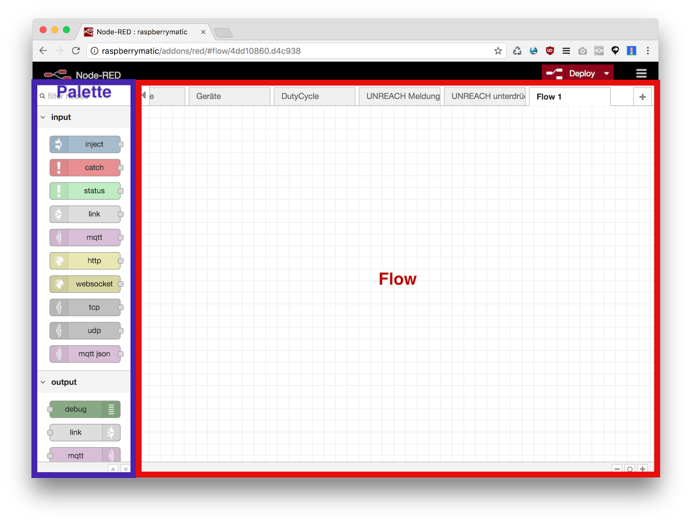

## Was ist Node-RED?

[Node-RED](https://nodered.org/about/) ist eine Nachrichtenflussbasierte, visuelle Programmierumgebung für das Internet 
der Dinge.  
Node-RED wird seit 2013 von [IBM Emerging Technology](https://emerging-technology.co.uk/technologies/) 
entwickelt und steht als kostenlose Open Source Software unter dem Dach der [JS Foundation](https://js.foundation/) zur 
Verfügung.    
Node-RED kann durch zusätzliche [Nodes](https://flows.nodered.org/?type=node&num_pages=1) erweitert werden, eine große 
und aktive Community hat Stand Heute bereits weit über 1000 Nodes entwickelt, die unterschiedlichste Services und 
Systeme in Node-RED integrieren.

Rund um das Thema Node-RED lassen sich unzählige Artikel, Tutorials, Dokumentationen, Bücher und Youtube Videos finden, zum Einstieg in Node-RED ist z.B. dieser Artikel https://entwickler.de/online/iot/node-red-iot-prototypen-2-579809637.html empfehlenswert.

## Crashkurs

* Aus der _Palette_ im linken Bildschirmbereich können _Nodes_ per Drag&Drop in den _Flow_ im rechten Bildschirmbereich platziert werden
* _Nodes_ können über einen Eingang auf der linken Seite und/oder einen Ausgang auf der rechten Seite mit anderen Nodes verbunden werden
* Nachdem ein _Flow_ verändert wurde müssen die Änderungen per klick auf _Deploy_ übernommen werden
* Der _Inject Node_ erzeugt bei klick auf den Button an seiner linken Seite eine _Message_
* Der _Debug Node_ zeigt eingehende _Messages_ im Debug Fenster an
* Das Debug Fenster befindet sich in der _Sidebar_, diese kann im Menü oben rechts unter View - Show Sidebar angezeigt werden

