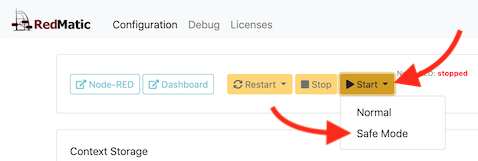

Für den Fall das Node-RED direkt nach dem Start Probleme verursacht, z.B. weil man aus versehen eine Endlosschleife programmiert hat oder fehlerhafte Nodes zum Absturz führen, gibt es die Möglichkeit Node-RED im sogenannten "Safe Mode" zu starten. Im Safe Mode werden zwar alle Flows geladen - aber nicht gestartet. Man kann dann fehlerhafte Flows korrigieren oder problematische Nodes entfernen und erst nach dem nächsten Deploy werden die Flows dann wieder gestartet.

