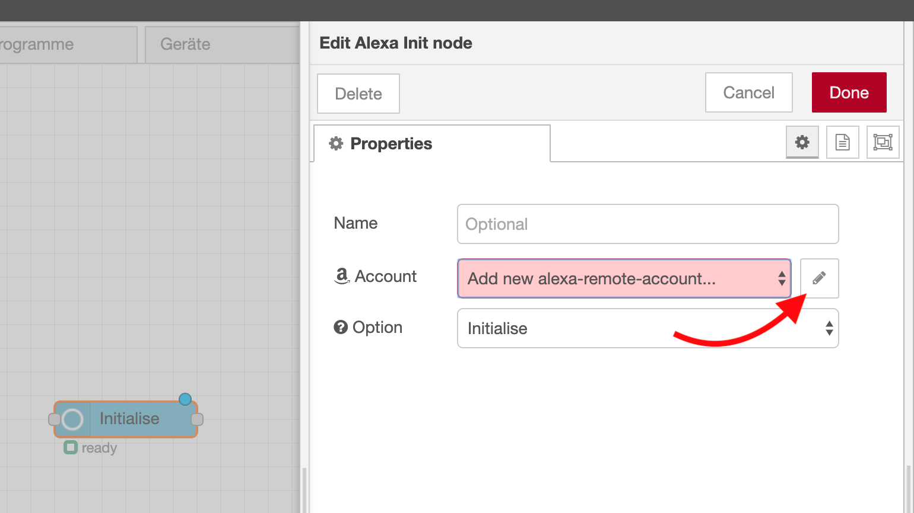
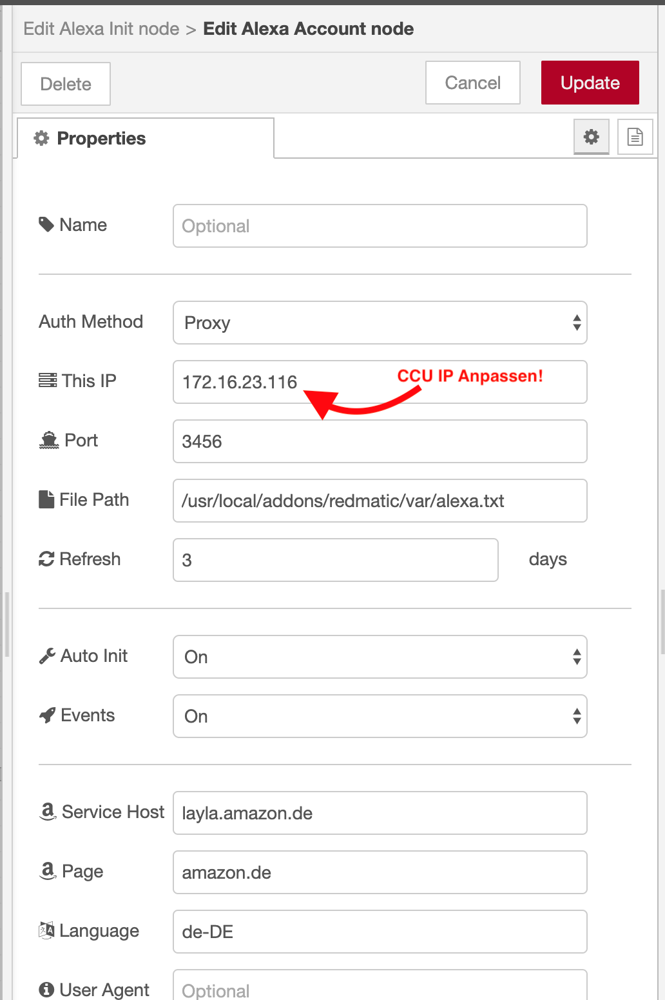
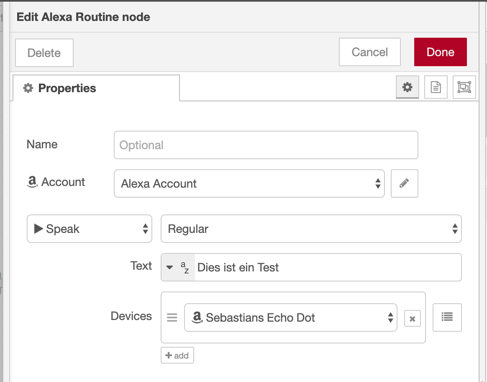

* Die Nodes [node-red-contrib-alexa-remote2](https://flows.nodered.org/node/node-red-contrib-alexa-remote2) installieren (siehe https://github.com/rdmtc/RedMatic/wiki/Node-Installation)
* Einen Node `Alexa Init` in den Flow ziehen und dessen Konfiguration öffnen
* Auf das Bleistifticon neben `Add new alexa-remote-account...` klicken: 
* Konfiguration des Alexa Account Node durchführen:
  * IP der CCU unter `This IP` eintragen.
  * Port kann auf Standardeinstellungen `3456` belassen werden. Dieser Port muss in der CCU Firewall erlaubt sein!
  * `Service Host` auf `layla.amazon.de` setzen
  * `Page` auf `amazon.de` setzen
  * `Language` auf `de-DE` setzen
  
* Alexa Account Node Konfigurationsfenster mit Klick auf Update schließen
* Alexa Init node Konfigurationsfenster mit Klick auf Done schließen
* Flow Deploy
* Im Browser `http://<ccu-ip>:3456` öffnen, bei Amazon anmelden
* Einen `Alexa Routine` Node in den Flow ziehen, `Account` auswählen, Echo auswählen. Beispielconfig: 
* Wird nun eine Nachricht in den Alexa Routine Node geschickt sollte das ausgewählte Echo sprechen :-)  
  
