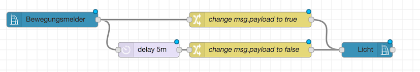
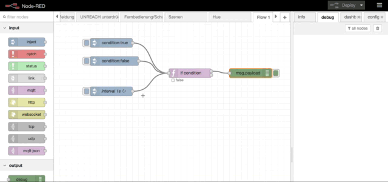
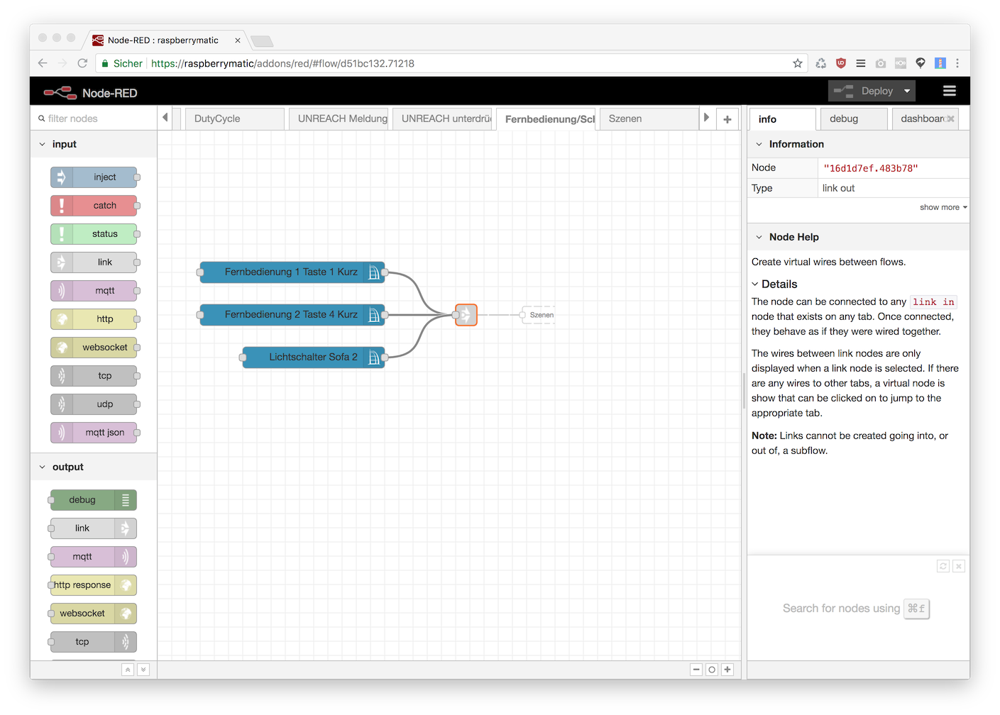
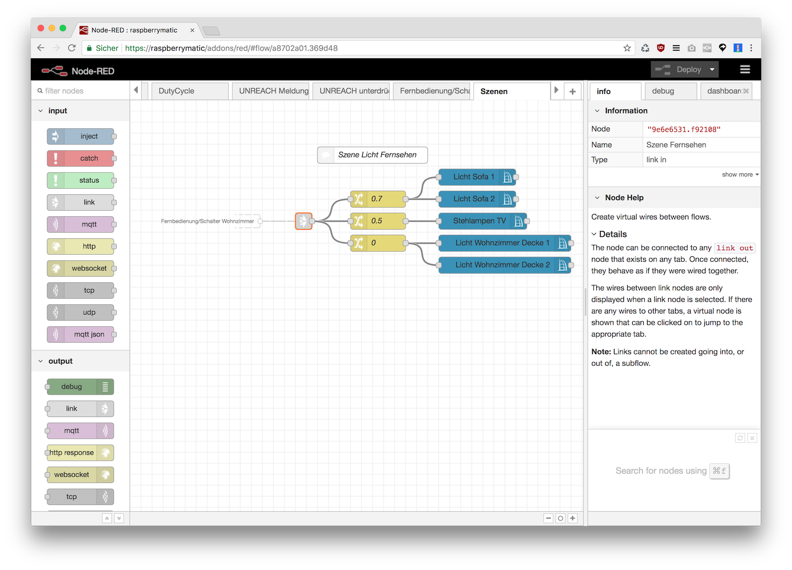

* Nodes
  * [Change Node](#change-node)
  * [Delay Node](#delay-node)
  * [Switch Node](#switch-node)
  * [If Node](#if-node)
  * [Time Range Node](#time-range)
* Flows
  * [Links](#links)
  * [Subflows](#subflows)
* Sonstiges  
  * [MQTT](#mqtt)

## Nodes

### Change Node

Mit diesem Node kann der Payload eine _Message_ manipuliert werden, um z.B. die `payload` _Property_ auf einen bestimmten Wert zu setzen.

### Delay Node

Verzögert die Weiterleitung einer _Message_ für eine bestimmte Zeit.

Beispiel: Lampe bei Bewegungserkennung anschalten und 5 Minuten verzögert wieder ausschalten 

### Switch Node

Der _Switch Node_ kann _Messages_ abhängig von ihren _Properties_ an unterschiedliche Ausgänge weiterleiten. So ist es z.B. möglich eine _Message_ nur dann weiterzuleiten wenn der Wert des _Payloads_ größer/kleiner/gleich einem konfigurierten Wert ist u.v.m.

### If Node

Der _If Node_ kann die Weiterleitung von _Messages_ in Abhängigkeit vorangegangenen _Messages_ mit bestimmter `payload` _Property_ steuern. 

### Time Range Node

Der _Time Range Node_ leitet Nachrichten in Abhängigkeit der Uhrzeit oder des Sonnenstands weiter. 

## Flows

### Links

Link Nodes ermöglichen es Flow-übergreifende Verbindungen einzurichten. Sie eignen sich z.B. gut um eine strukturierte Szenen-Steuerung zu realisieren:

### Subflows

Mit `Subflows` kann man `Flows` zu komfortabel wiederverwendbaren `Nodes` machen. Dieses lang erwartete Feature macht umfangreichere Programmierung mit Node-RED wesentlich übersichtlicher und erspart einem mehrfach gleiche Abläufe auf diverse Flows kopieren zu müssen.

## Sonstiges

### MQTT

Node-RED eignet sich hervorragend zur Ansteuerung von Geräten oder Empfang von (Sensor-)Daten via MQTT.

* [Mosquitto MQTT Broker als CCU3/RaspberryMatic Addon](https://github.com/hobbyquaker/ccu-addon-mosquitto)
* [MQTT Link Liste](https://github.com/hobbyquaker/awesome-mqtt)