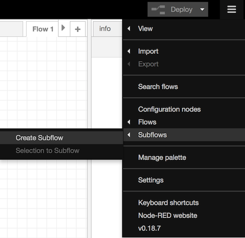
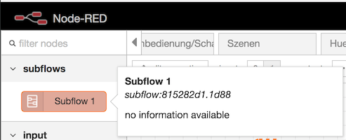

* Nodes
  * [Change Node](#change-node)
  * [Delay Node](#delay-node)
  * [Switch Node](#switch-node)
  * [If Node](#if-node)
  * [Time Range Node](#time-range)
* Flows
  * [Deaktiveren](#deaktivieren)
  * [Links](#links)
  * [Subflows](#subflows)
* Sonstiges  
  * [MQTT](#mqtt)

## Nodes

### Change Node

Mit diesem Node kann der Payload eine _Message_ manipuliert werden, um z.B. die `payload` _Property_ auf einen bestimmten Wert zu setzen.

### Delay Node

Verzögert die Weiterleitung einer _Message_ für eine bestimmte Zeit.

Beispiel: Lampe bei Bewegungserkennung anschalten und 5 Minuten verzögert wieder ausschalten 

### Switch Node

Der _Switch Node_ kann _Messages_ abhängig von ihren _Properties_ an unterschiedliche Ausgänge weiterleiten. So ist es z.B. möglich eine _Message_ nur dann weiterzuleiten wenn der Wert des _Payloads_ größer/kleiner/gleich einem konfigurierten Wert ist u.v.m.

### If Node

Der _If Node_ kann die Weiterleitung von _Messages_ in Abhängigkeit vorangegangenen _Messages_ mit bestimmter `payload` _Property_ steuern. 

#### Beispiel im Detail zum runterladen


```
[{"id":"44db931f.f98a6c","type":"inject","z":"b5373d6e.8ce46","name":"Interval 2s","topic":"","payload":"Time is over","payloadType":"str","repeat":"2","crontab":"","once":false,"onceDelay":0.1,"x":179,"y":695,"wires":[["7a312e52.c6bec"]]},{"id":"7b63c8dc.b7e878","type":"debug","z":"b5373d6e.8ce46","name":"","active":true,"tosidebar":true,"console":false,"tostatus":false,"complete":"false","x":612,"y":622,"wires":[]},{"id":"73e324ed.4bc17c","type":"inject","z":"b5373d6e.8ce46","name":"Acitvate with True","topic":"condition","payload":"true","payloadType":"bool","repeat":"","crontab":"","once":false,"onceDelay":0.1,"x":157,"y":596,"wires":[["7a312e52.c6bec"]]},{"id":"3d9d8c3b.c87f14","type":"inject","z":"b5373d6e.8ce46","name":"Deactivate with False","topic":"condition","payload":"false","payloadType":"bool","repeat":"","crontab":"","once":false,"onceDelay":0.1,"x":149,"y":648,"wires":[["7a312e52.c6bec"]]},{"id":"7a312e52.c6bec","type":"combine-if","z":"b5373d6e.8ce46","topic":"condition","name":"","timeout":0,"x":419.70001220703125,"y":629,"wires":[["7b63c8dc.b7e878"],[]]}]
```

### Time Range Node

Der _Time Range Node_ leitet Nachrichten in Abhängigkeit der Uhrzeit oder des Sonnenstands weiter. 

## Flows

### Deaktivieren

Über Doppelklick auf den Reiter eines Flows kann dieser umbenannt und (de)aktiviert werden.

### Links

Link Nodes ermöglichen es Flow-übergreifende Verbindungen einzurichten. Sie eignen sich z.B. gut um eine strukturierte Szenen-Steuerung zu realisieren:


### Subflows

Mit _Subflows_ kann man _Flows_ in komfortabel wiederverwendbaren _Nodes_ "verpacken". Dieses lang erwartete Feature macht umfangreichere Programmierung mit Node-RED wesentlich übersichtlicher und vermeidet es gleiche Abläufe auf mehrere Flows kopieren zu müssen.

_Subflows_ werden über das Menü angelegt und stehen nach dem sie _deployed_ wurden in der _Palette_ zur Verfügung und können dann wie "normale" _Nodes_ verwendet werden.





## Sonstiges

### MQTT

Node-RED eignet sich hervorragend zur Ansteuerung von Geräten oder Empfang von (Sensor-)Daten via MQTT.

* [Mosquitto MQTT Broker als CCU3/RaspberryMatic Addon](https://github.com/hobbyquaker/ccu-addon-mosquitto)
* [MQTT Link Liste](https://github.com/hobbyquaker/awesome-mqtt)