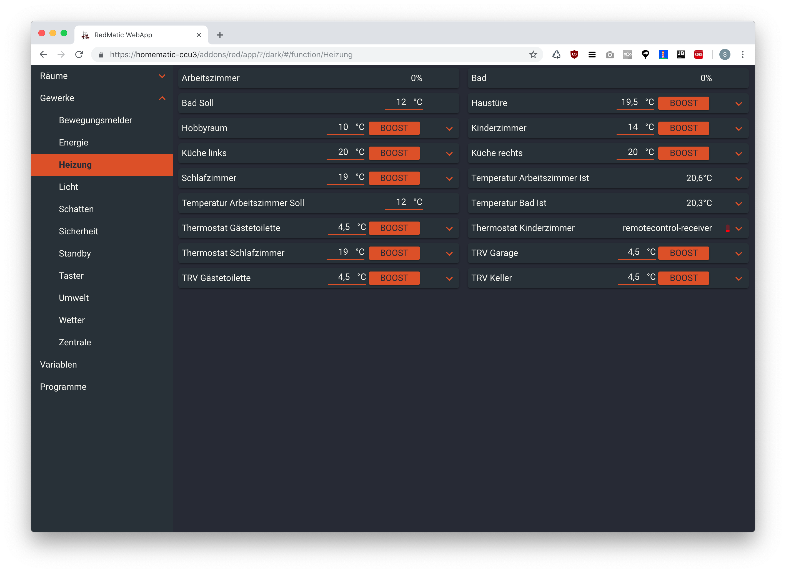
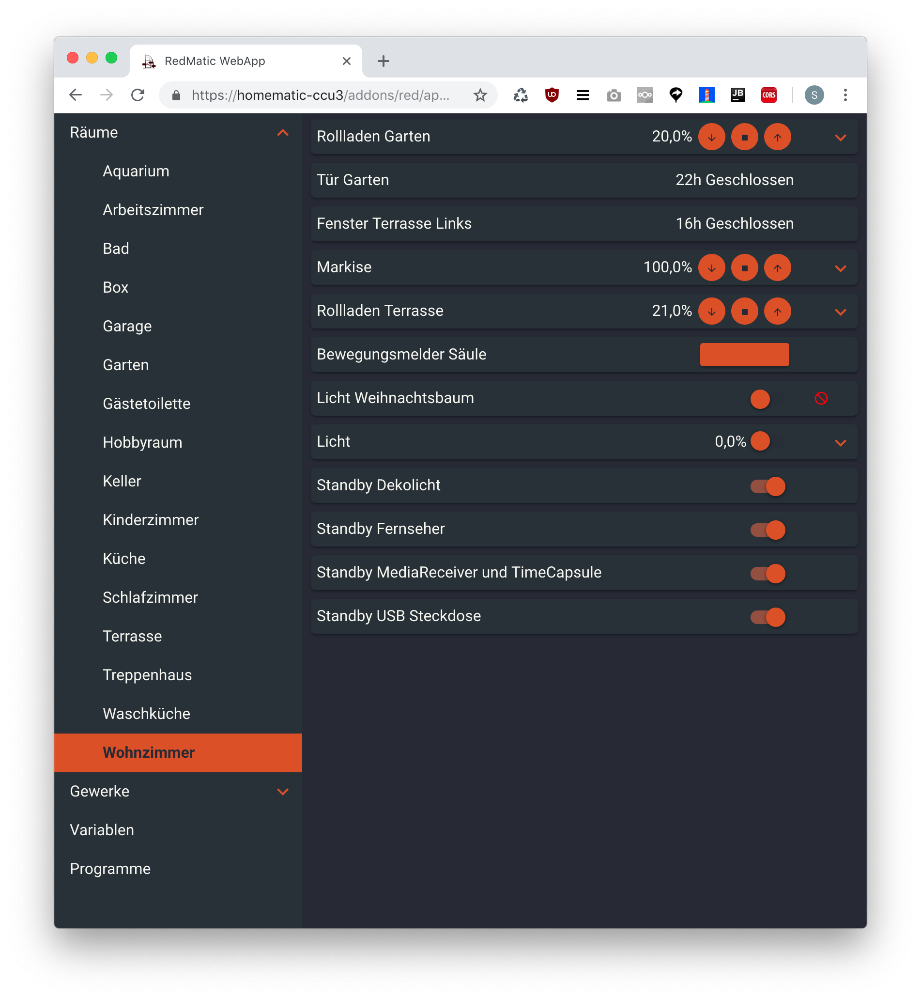
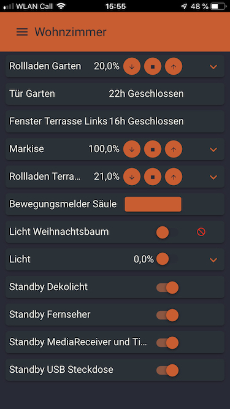
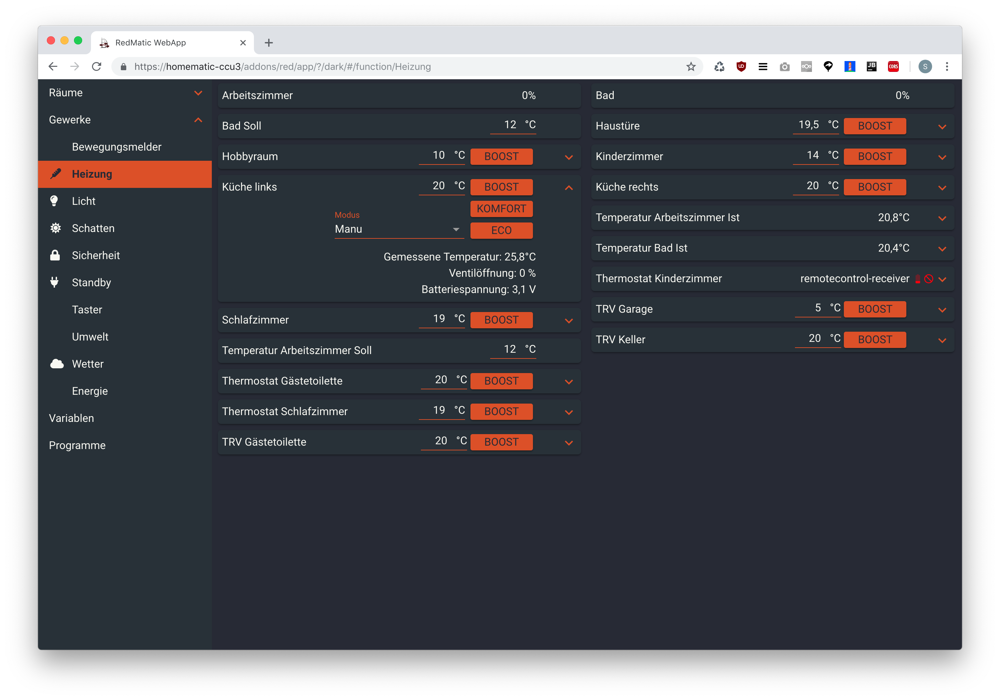
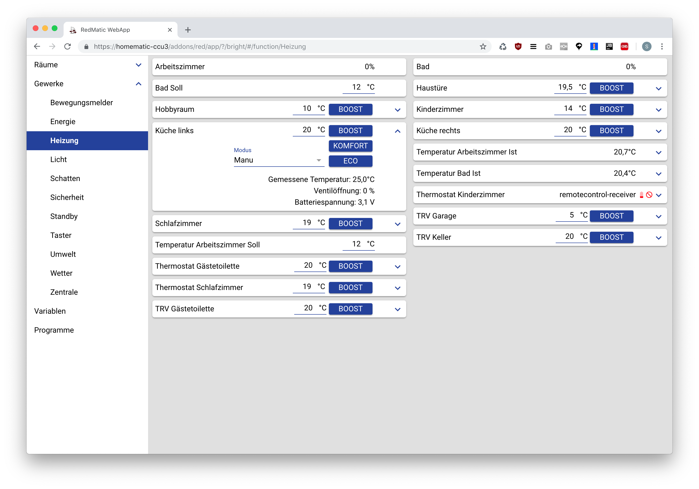

## Screenshots

Add node "RedMatic / WebApp" to **any** flow and deploy. 
Use the URL from WebApp configuration from attribute "App URL", for example 
use `http://<your-ccu-address>/addons/red/app/?/app`

